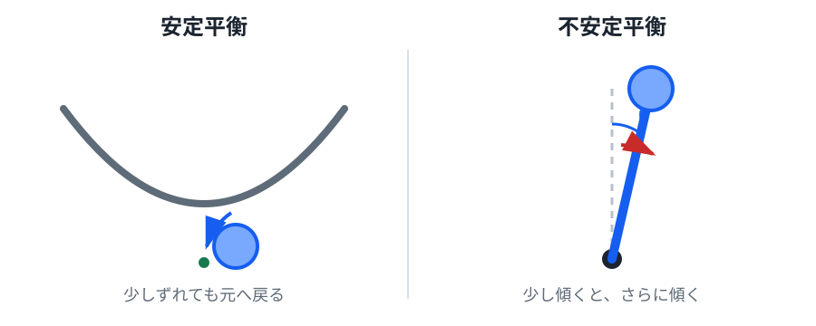

# 01. なぜ二足立位は難しいのか

> **前提**: 力、重力、トルク、重心、ベクトルの初歩。
>
> **この章のゴール**: 二足立位を「高い位置にある重心を、狭く変化する接触領域で支える不安定系」として説明し、以後に倒立振子・ZMP・LIPMが必要になる理由を理解する。

二足歩行を理解する最初のポイントは、**「立っている」は静止して見えても、制御なしでは不安定になりやすい**ということです。

ロボット制御では、いきなり関節角を何十個も並べるより、まず

- 何が自然に安定なのか
- 何が自然に不安定なのか
- 床との接触によって何が制約されるのか
- どの量を測り、どの量を操作すれば倒れにくくなるのか

を分けて考えると見通しがよくなります。

## 1. 平衡点とは何か

物体がある状態にとどまり続けられるとき、その状態を**平衡点**と呼びます。

たとえば水平な床の上で静止している物体は、速度が 0 のままなら静止を続けます。ただし、「平衡である」ことと「少し乱されたあと元へ戻る」ことは同じではありません。

### 安定な平衡

ボールをお椀の底へ置くと、少し横へずらしても重力によって底へ戻ろうとします。

これは**安定平衡**の直感です。

### 不安定な平衡

棒を指先の上へ立てると、完全に直立している瞬間だけは力の釣り合いを作れます。しかし少し傾くと、重力はその傾きをさらに増やす向きへ働きます。

これは**不安定平衡**です。

*図1：安定系では小さなずれを打ち消す方向へ力が働き、倒立振子では小さなずれを増幅する方向へ重力トルクが働きます。*

重要なのは、直立状態が「存在しない」のではないことです。

**直立は平衡点ではあるが、そこから少し外れると自然には戻らない**、というのが難しさです。

## 2. 二足立位を最初は倒立振子として見る

人間や二足ロボットでは、全身の重心は足元より高い位置にあります。

横から見たとき、まず大胆に

- 足元を支点
- 全身質量を1個の質点
- 脚を質量のない棒

とみなすと、二足立位は倒立振子に似ています。

もちろん実際のロボットは多関節です。しかし、この単純化だけで

> なぜ直立を放置すると倒れるのか

を説明できます。

第02章では、この直感を Newton / Euler の運動方程式へ落とします。

## 3. 床との接触が作る「使える領域」

二足ロボットは空中で自由に力を出せるわけではありません。床を押し、その反作用で身体を動かします。

床に接している足裏を上から見て、その接触領域の凸包を**支持多角形**と呼びます。

- 両足で立つ: 支持多角形は広い
- 片足で立つ: 支持多角形はほぼ片足分まで狭くなる
- 足を上げる: その足は支持に使えなくなる

つまり歩行では、身体の状態だけでなく**「今どこが床に接触しているか」そのものが時間とともに変化**します。

## 4. 静止しているときの最初の安定条件

完全に静止し、加速度がなく、十分な摩擦があると仮定します。

このとき重心の鉛直投影が支持多角形の内側にあれば、重力による転倒モーメントを床反力で支えられる余地があります。

これは静的安定性を見る最初の条件です。

ただし、ここには強い仮定があります。

- 加速度がほぼ 0
- 足が滑らない
- 足裏が十分に面接触している
- 大きな上半身角運動量を使っていない

したがって

> 重心投影が足裏の中なら、歩いていても安全

とは言えません。

## 5. 歩行では「位置」だけでは足りない

同じ重心位置でも、速度が違えば転倒のしやすさは変わります。

たとえば重心が足の真上にあっても、前向きに大きな速度を持っていれば、そのままでは前へ倒れます。

歩行中には重心が加速・減速するため、床反力がどこへ作用し、どのモーメントを作っているかを見る必要があります。

そこで後半で登場するのが **Zero Moment Point（ZMP）** です。

簡略化すると、ZMP は

> 床反力が作る転倒モーメントを整理するための床面上の代表点

です。

ZMP が支持領域内にあるかどうかは、現在の接触だけで要求された運動を作れるかを見る重要な手掛かりになります。

支持多角形と ZMP は [06. 支持多角形と ZMP](06_zmp_support_polygon.md) で式から導きます。

## 6. 二足歩行は「連続運動 + 接触切替」

足が床に着いている間、身体の位置や速度は時間とともに連続的に変化します。

一方で、

- 右足が離地する
- 左足が着地する
- 両足支持から片足支持へ変わる

といった出来事では、運動方程式に入る接触条件そのものが切り替わります。

このように、

- 連続時間の運動
- 離散的なモード切替

を同時に持つ系を**ハイブリッド系**と呼びます。

この用語自体は発展的ですが、「歩行は同じ式を永遠に解けばよい問題ではない」と理解するために重要です。

## 7. 制御器は何をしているのか

立位・歩行制御を概念的に分解すると、次の閉ループになります。

1. IMU、関節エンコーダ、足裏センサなどで状態を測る
2. ノイズを含む測定値から現在状態を推定する
3. 目標状態との差や転倒傾向を評価する
4. 足首・股関節・床反力・次の着地点を決める
5. モータへ指令する
6. 身体が動き、再び測定する

つまり、二足歩行は一度軌道を計算して終わる問題ではありません。

**身体が実際にどう動いたかを戻し続けるフィードバック制御**が中心になります。

## 8. なぜ二足歩行が難しいのか

難しさを整理すると、主に次の要素へ分解できます。

- 直立付近が不安定平衡になりやすい
- 支持領域が狭い
- 歩くたび支持脚が切り替わる
- 接触が入ったり切れたりする
- 足裏には摩擦限界がある
- 関節トルク・速度には上限がある
- センサにはノイズと遅延がある
- モデル化していない柔軟性や遊びがある
- 外乱が大きいと、姿勢修正だけでなく一歩踏み出す必要がある

したがって「倒れない」は、単一の条件ではありません。

小さい外乱なら足首トルクだけで戻せても、大きい外乱では股関節やステップが必要になります。

## 9. この教材で何を捨て、何を残すか

第1版では、最初から実機相当の複雑さを扱いません。

いったん捨てるもの:

- 3次元運動
- 多リンク剛体の完全モデル
- 脚自身の分布質量
- 足裏の詳細な圧力分布
- 摩擦円錐
- 関節弾性
- センサノイズ
- 通信遅延
- 状態推定誤差

残すもの:

- 重力による不安定化
- フィードバック
- 状態と固有値
- 支持領域
- 床反力の作用位置
- 重心位置と速度
- ステップによる支持領域の移動

これは現実を無視するためではありません。

**複雑な現象から、転倒と回復に直接効く構造を一つずつ取り出すため**です。

## 補講: 「劣駆動」という見方

> ここは発展事項です。本編を進むだけなら読み飛ばして構いません。

一般に、自由度の数だけ独立なアクチュエータを持たない系を**劣駆動系**と呼びます。

足が床に固定されていない歩行ロボットでは、全身の並進・回転をモータが空間へ直接加えることはできません。関節トルクで姿勢を変え、床との接触力を通して全身運動を作ります。

この意味で、二足歩行は

> 関節を動かす問題

だけではなく

> 接触を使って、直接は駆動できない全身運動を間接的に制御する問題

でもあります。

後に ZMP や着地点制御が重要になる背景です。

## 次へ

次章では、最小の不安定モデルである [倒立振子](02_inverted_pendulum.md) を使い、

> 少し傾くと、なぜその傾きが指数的に増えるのか

を運動方程式から導きます。
