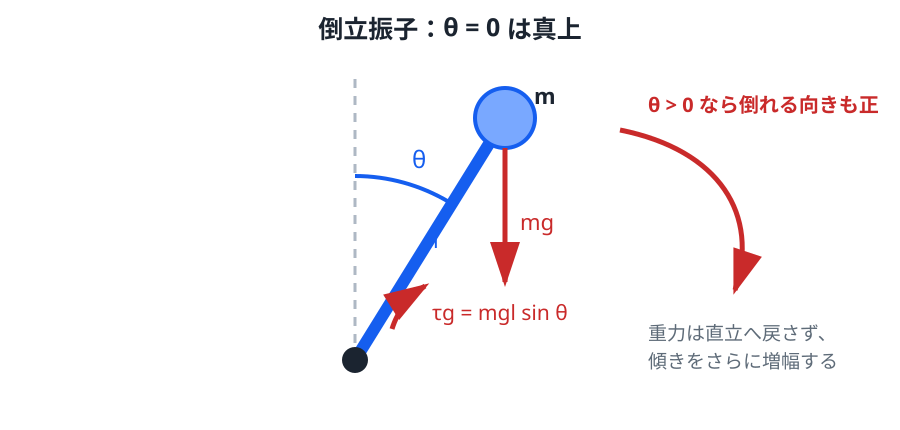
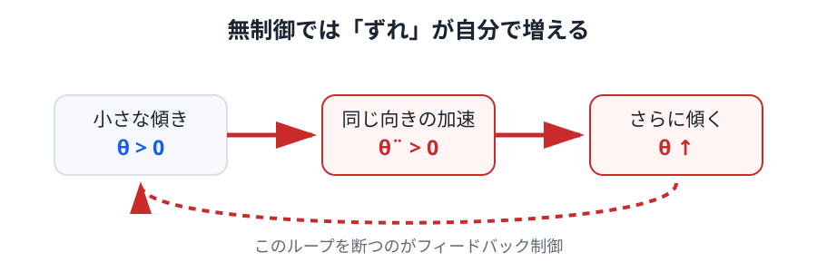

# 02. 倒立振子 — なぜ少し傾くと倒れるのか

> **前提**: Newton の運動方程式、トルク、三角関数、2階常微分方程式の初歩。
>
> **この章のゴール**: 倒立振子の運動方程式を力学から導き、直立付近を線形化すると不安定な指数モードが現れることを理解する。

最も単純なモデルとして、質量 $m$ の質点が、長さ $l$ の質量のない棒の先に付いている倒立振子を考えます。

角度 $\theta=0$ を真上とし、右へ傾く向きを $\theta>0$ とします。制御トルク $u$ も、$\theta$ を増やす向きを正とします。

*図1：$\theta>0$ は右へ傾く向きです。重力 $mg$ は下向きに作用し、支点まわりには傾きをさらに増やす向きのトルクが生じます。*

## 1. まず何をモデル化しているか

この章では、実際のロボットから次を捨てています。

- 脚の質量
- 関節の数
- 足裏の有限な大きさ
- 摩擦
- モータの飽和
- センサノイズ

残すのは

- 重力
- 支点まわりの回転
- 制御トルク

だけです。

それでも「直立がなぜ自然には保てないか」は説明できます。

## 2. 重力トルクを求める

支点から質点までの位置ベクトルの長さは $l$ です。

重力の大きさは $mg$ で、棒と重力のなす角から支点まわりのトルクの大きさは

$$
|\tau_g|=mgl\sin\theta
$$

となります。

ここで符号が重要です。

$\theta>0$ のとき、重力はさらに右へ倒す向きに働くので、今回の符号規約では

$$
\tau_g=mgl\sin\theta
$$

です。

通常の「下向き振子」では重力が角度を戻す向きに働きますが、倒立振子では符号が逆になります。

## 3. 回転の運動方程式

回転運動では

$$
I\ddot{\theta}=\sum \tau
$$

を使います。

質点が支点から距離 $l$ にあるので、支点まわりの慣性モーメントは

$$
I=ml^2
$$

です。

重力トルクと制御トルク $u$ を足すと

$$
ml^2\ddot{\theta}=mgl\sin\theta+u
$$

したがって

$$
\ddot{\theta}
=
\frac{g}{l}\sin\theta
+
\frac{1}{ml^2}u
$$

を得ます。

この式はまだ**非線形**です。$\sin\theta$ が入っているためです。

## 4. この式の各項は何を意味するか

$$
\ddot{\theta}
=
\frac{g}{l}\sin\theta
+
\frac{1}{ml^2}u
$$

を読むと、

- $\frac{g}{l}\sin\theta$: 重力による自然な倒れ方
- $\frac{1}{ml^2}u$: モータトルクによる角加速度

に分かれます。

$l$ が長いほど $g/l$ は小さくなるため、同じ角度なら角加速度は小さくなります。長い倒立振子の方が、短いものよりゆっくり倒れる直感と一致します。

## 5. 直立付近で線形化する

直立付近、つまり $|\theta|$ が十分小さい範囲だけを考えます。

Taylor 展開すると

$$
\sin\theta
=
\theta-rac{\theta^3}{6}+\cdots
$$

なので、1次の項だけ残せば

$$
\sin\theta\approx\theta
$$

です。

これを運動方程式へ代入すると

$$
\ddot{\theta}
\approx
\frac{g}{l}\theta
+
\frac{1}{ml^2}u
$$

となります。

以後、この直立近傍の線形モデルを扱うときは、近似であることを忘れないでください。

たとえば $10^\circ\approx0.175\ \mathrm{rad}$ では $\sin\theta$ と $\theta$ の差は小さいですが、角度が大きくなるほど3次以上の項を無視できなくなります。

## 6. 無制御ならどうなるか

制御を切って $u=0$ とすると

$$
\ddot{\theta}
=
\frac{g}{l}\theta
$$

です。

ここで

$$
\omega_0=\sqrt{\frac{g}{l}}
$$

と置けば

$$
\ddot{\theta}=\omega_0^2\theta
$$

です。

通常のばね振動

$$
\ddot{x}=-\omega^2x
$$

とは符号が逆であることに注目してください。

*図2：無制御では「傾く → 同じ向きへ加速する → さらに傾く」という正のフィードバックに似た誤差増幅が起きます。*

## 7. 微分方程式を解いて不安定性を見る

指数関数

$$
\theta(t)=e^{rt}
$$

を仮定して代入すると

$$
r^2e^{rt}=\omega_0^2e^{rt}
$$

なので

$$
r^2=\omega_0^2
$$

です。

したがって

$$
r=\pm\omega_0
$$

を得ます。

一般解は

$$
\theta(t)
=
C_1e^{\omega_0 t}
+
C_2e^{-\omega_0 t}
$$

です。

第2項は時間とともに減りますが、第1項は

$$
e^{\omega_0 t}
$$

として増大します。

初期条件が完全に特殊で $C_1=0$ にならない限り、成長モードが残ります。

これが「少し傾くと倒れる」の数学的な中身です。

## 8. 倒れる速さの目安

$\omega_0=\sqrt{g/l}$ なので、自然な時間スケールは

$$
T_c=\frac{1}{\omega_0}=\sqrt{\frac{l}{g}}
$$

です。

たとえば $l=1.0\ \mathrm{m}$、$g=9.81\ \mathrm{m/s^2}$ なら

$$
\omega_0\approx3.13\ \mathrm{s^{-1}}
$$

なので

$$
T_c\approx0.32\ \mathrm{s}
$$

です。

つまり無制御の誤差は、数秒単位ではなく**数百ミリ秒程度の時間スケールで急速に大きくなり得る**ことが分かります。

これは制御周期やセンサ遅延が重要になる理由にもつながります。

## 9. エネルギーから見ても不安定

角度 $\theta$ での高さは

$$
y=l\cos\theta
$$

なので、位置エネルギーは

$$
V(\theta)=mgl\cos\theta
$$

です。

$\theta=0$ では

$$
V(0)=mgl
$$

で、これは近傍で最大です。

Taylor 展開すると

$$
V(\theta)
\approx
mgl
-
\frac{mgl}{2}\theta^2
$$

となります。

少し傾くと位置エネルギーが下がるので、自然には直立へ戻るのではなく、そこから離れる方向へ動きます。

運動方程式とエネルギーの両方から、直立が不安定であることを確認できます。

## 10. 完全にまっすぐなら倒れないのでは？

理想数学では

$$
\theta(0)=0,
\qquad
\dot{\theta}(0)=0
$$

かつ外乱が一切なければ、そのままです。

しかし実機では

- センサ誤差
- 床の傾き
- モータのばらつき
- 機械的な遊び
- 振動
- モデル誤差

が必ずあります。

不安定系では、ごく小さな誤差でも成長モードへ入ります。

したがって**不安定平衡点を維持するには継続的なフィードバックが必要**です。

## 実験

[Lab 1: 無制御倒立振子](../labs/01-open-loop/) を開き、初期角度を $1^\circ$、$3^\circ$、$5^\circ$ と変えてください。

見るべきなのは単に「倒れたか」ではありません。

- 初期角度を大きくすると転倒までの時間はどう変わるか
- 初期角度が小さくても最終的に誤差が成長するか
- 線形モデルで予想した指数的な増幅と、シミュレーションの初期挙動が対応しているか

を観察してください。

## 補講: 線形化は何をしているのか

> ここは発展事項です。Taylor 展開の意味を、制御でどう使うか確認する節です。

非線形方程式

$$
\ddot{\theta}
=
f(\theta,u)
$$

を平衡点 $\theta=0,u=0$ の近くで考えると、1次 Taylor 展開により

$$
f(\theta,u)
\approx
f(0,0)
+
\left.\frac{\partial f}{\partial\theta}\right|_{0,0}\theta
+
\left.\frac{\partial f}{\partial u}\right|_{0,0}u
$$

と書けます。

今回

$$
f(\theta,u)
=
\frac{g}{l}\sin\theta
+
\frac{1}{ml^2}u
$$

なので

$$
f(0,0)=0
$$

$$
\left.\frac{\partial f}{\partial\theta}\right|_{0,0}
=
\frac{g}{l}
$$

$$
\left.\frac{\partial f}{\partial u}\right|_{0,0}
=
\frac{1}{ml^2}
$$

となり、先ほどの線形モデルが得られます。

線形化とは「非線形性を無視する魔法」ではなく、**ある平衡点の近くで微分係数を使って局所的な傾きを取り出す操作**です。

## 次へ

次章では、成長モードを打ち消すために

$$
u=-K_p\theta-K_d\dot{\theta}
$$

という [PD / PID フィードバック](03_pid_feedback.md) を導入します。
