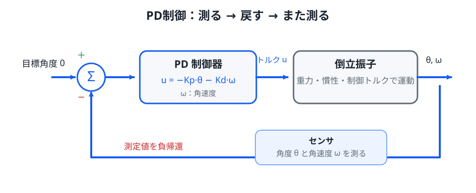

# 03. PID / PDフィードバック — 倒れそうなら戻す

> **前提**: 第02章の線形化倒立振子、2次方程式、指数関数。
>
> **この章のゴール**: P・D・I 各項の役割を運動方程式から説明し、PD 制御で直立付近を漸近安定化する条件を理解する。

倒立振子の直立角度を $\theta=0$ に保ちたいとします。

最も単純な発想は

> 傾いたら、傾きと逆向きにトルクを出す

です。

ただし制御では、1回だけ補正して終わるのではありません。現在の姿勢を測り、その結果を何度も入力へ戻します。

*図1：図中では角速度を $\omega=\dot{\theta}$ と表します。実際の $\theta,\dot{\theta}$ を測り、PD制御器が毎時刻トルク $u$ を更新します。*

## 1. 開ループから閉ループへ

第02章の直立近傍モデルは

$$
\ddot{\theta}
=
\frac{g}{l}\theta
+
\frac{1}{ml^2}u
$$

でした。

入力 $u$ をあらかじめ時間だけの関数として決めるなら、現在の誤差を見ない**開ループ制御**です。

一方、

$$
u=u(\theta,\dot{\theta})
$$

のように現在状態から入力を決めれば、出力を入力へ戻す**閉ループ制御**になります。

倒立振子のような不安定系では、この閉ループ化が本質です。

## 2. P制御: 傾きに比例して戻す

比例制御を

$$
u=-K_p\theta
$$

とします。

$K_p>0$ なら、$\theta>0$ のとき $u<0$ となり、傾きと逆向きへトルクを出します。

これを運動方程式へ代入すると

$$
\ddot{\theta}
=
\frac{g}{l}\theta
-
\frac{K_p}{ml^2}\theta
$$

したがって

$$
\ddot{\theta}
+
\left(
\frac{K_p}{ml^2}-\frac{g}{l}
\right)\theta
=0
$$

です。

ここで

$$
\frac{K_p}{ml^2}-\frac{g}{l}>0
$$

すなわち

$$
K_p>mgl
$$

なら、式はばね振動と同じ符号になります。

これは

> P ゲインが重力による不安定化より強い

という条件です。

## 3. ただし P だけでは原点へ収束しない

$K_p>mgl$ として

$$
\omega_n^2
=
\frac{K_p}{ml^2}-\frac{g}{l}
$$

と置くと

$$
\ddot{\theta}+\omega_n^2\theta=0
$$

です。

一般解は

$$
\theta(t)
=
A\cos\omega_n t
+
B\sin\omega_n t
$$

となります。

つまり理想モデルでは、振幅を減らす仕組みがありません。

P 制御は「倒れ続ける系」を「振動する系」へ変えられますが、**それだけでは直立へ漸近収束しません**。

この区別は重要です。

## 4. D制御: 倒れる勢いへブレーキを掛ける

そこで角速度も使い

$$
u=-K_p\theta-K_d\dot{\theta}
$$

とします。

これが PD 制御です。

運動方程式へ代入すると

$$
\ddot{\theta}
=
\frac{g}{l}\theta
-
\frac{K_p}{ml^2}\theta
-
\frac{K_d}{ml^2}\dot{\theta}
$$

整理して

$$
\ddot{\theta}
+
\frac{K_d}{ml^2}\dot{\theta}
+
\left(
\frac{K_p}{ml^2}-\frac{g}{l}
\right)\theta
=0
$$

です。

D 項は速度に逆らうので、機械系のダンパと同じ役割を持ちます。

- $\theta$: どれだけ倒れているか
- $\dot{\theta}$: どれだけの勢いで倒れつつあるか

を同時に見ているわけです。

## 5. PD制御の安定条件

指数解

$$
\theta(t)=e^{rt}
$$

を仮定すると、特性方程式は

$$
r^2
+
\frac{K_d}{ml^2}r
+
\left(
\frac{K_p}{ml^2}-\frac{g}{l}
\right)
=0
$$

です。

2次方程式

$$
r^2+ar+b=0
$$

の両方の根の実部を負にするには、今回のような2次系では

$$
a>0,
\qquad
b>0
$$

が必要です。

したがって

$$
K_d>0
$$

かつ

$$
K_p>mgl
$$

なら、線形化モデルの原点

$$
\theta=0,
\qquad
\dot{\theta}=0
$$

は漸近安定になります。

ここで言っているのは、**直立近傍の線形化モデル上での局所的な結論**です。

実機で大角度まで必ず復帰できる、という意味ではありません。

## 6. 2次系として読む

標準的な2次系

$$
\ddot{\theta}
+
2\zeta\omega_n\dot{\theta}
+
\omega_n^2\theta
=0
$$

と比較すると

$$
\omega_n^2
=
\frac{K_p}{ml^2}-\frac{g}{l}
$$

$$
2\zeta\omega_n
=
\frac{K_d}{ml^2}
$$

です。

ここで

- $\omega_n$: 応答の速さを決める固有角周波数
- $\zeta$: 振動の減衰具合を表す減衰比

です。

$K_p$ を上げると一般に戻す力は強くなり、$K_d$ を上げると減衰が強くなります。

ただし両者は独立ではなく、$\zeta$ には $\omega_n$ も入るため、ゲインを一方ずつ見れば十分というわけではありません。

## 7. 減衰比と応答の形

理想的な2次系では、概ね次のように読めます。

- $0<\zeta<1$: 振動しながら減衰
- $\zeta=1$: 臨界減衰
- $\zeta>1$: 振動せずゆっくり戻る

実機ではセンサノイズ、離散時間化、トルク飽和があるため、この分類どおりに完全一致するとは限りません。

それでも「速さ」と「振動性」を別々の言葉で考える助けになります。

## 8. PID の I は何をするか

積分項も加えると

$$
u=-K_p\theta-K_d\dot{\theta}-K_i\int_0^t\theta(\tau)\,d\tau
$$

となります。

I 項は、一定の外乱やモデル誤差のせいで小さな偏りが残る場合に、その偏りを時間方向へ蓄積して打ち消します。

たとえば実機で、

- 重心位置のモデルが少しずれている
- モータに一定のバイアスがある
- センサのゼロ点が少しずれている

と、P/D だけでは小さな定常偏差が残ることがあります。

I 項はこれを減らすのに有効です。

ただし倒立振子の姿勢安定化では、まず PD だけで主要な現象を理解できます。

## 9. なぜゲインを無限に大きくできないのか

理想式だけを見ると、大きな $K_p,K_d$ を使えばよさそうに見えます。

しかし実機には次があります。

- モータトルク上限
- 電流上限
- 関節速度上限
- センサノイズ
- サンプリング周期
- 演算遅延
- 機構の柔軟性

特に D 項は速度を使うため、高周波ノイズを拾いやすい性質があります。

角速度を

$$
\dot{\theta}
\approx
\frac{\theta_k-\theta_{k-1}}{\Delta t}
$$

のような差分だけで求めると、わずかな角度ノイズが $1/\Delta t$ 倍されることがあります。

IMU の角速度を直接使ったり、フィルタを入れたりするのはこのためです。

## 10. I項の windup

モータが最大トルクへ張り付いているのに、積分器だけが誤差を積み続けると

$$
\int\theta\,dt
$$

が非常に大きくなります。

その後、姿勢が戻っても積分値が残り、逆方向へ大きく行き過ぎることがあります。

これを**integral windup** と呼びます。

実装では

- 積分値を制限する
- 入力飽和中は積分を止める
- 飽和との差を積分器へ戻す

などの anti-windup が使われます。

## 11. 外乱応答を見る

立っているロボットを横から押すと、角度だけでなく角速度も一気に変わります。

同じ $\theta$ でも

- ゆっくり傾いている
- 高速で倒れつつある

では危険度が違います。

D 項があると「勢い」も制御入力へ反映できるため、外乱からの回復が大きく改善します。

## 実験

[Lab 2: PD制御](../labs/02-pid-balance/) で、次を試してください。

1. $K_p=0,K_d=0$ で無制御にする
2. $K_d=0$ のまま $K_p$ を増やす
3. $K_p$ を十分大きくした状態で $K_d$ を少しずつ増やす
4. 安定後に「押す」ボタンを押す

観察するときは

- 倒れなくなったか
- 原点へ戻るか
- 振動するか
- 戻るまで何秒かかるか
- 大外乱で入力飽和が起きないか

を分けて見てください。

**「倒れない」と「速く静かに戻る」は別の性能指標**です。

## 補講: 極配置として見る

> ここからは、固有値と状態空間表現へ進むための橋渡しです。

特性方程式の根 $r_1,r_2$ は、閉ループ系の時間応答を決めます。

たとえば

$$
r=-2\pm3i
$$

なら、振動しながら概ね $e^{-2t}$ で減衰します。

PD ゲイン $K_p,K_d$ を選ぶことは、特性方程式の係数を変え、結果として閉ループの根を動かすことです。

この根は、第04章の状態空間表現では**閉ループ行列の固有値**として同じものが現れます。

つまり

> PD のゲインチューニング

と

> 状態フィードバックで固有値を配置する

は、同じ構造を違う書き方で見ています。

## 次へ

PD制御は、角度と角速度をまとめて状態ベクトルにすれば

$$
u=-Kx
$$

と書けます。

次章では [状態空間表現](04_state_space.md) を導入し、多変数のロボット制御へ拡張しやすい形へ整理します。
