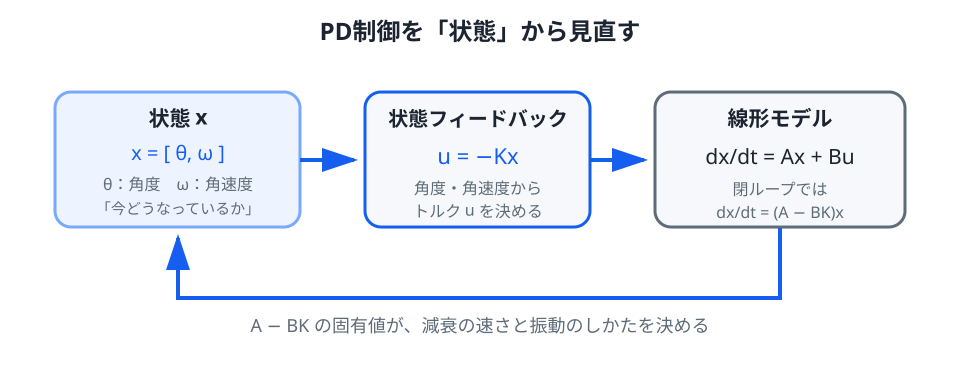

# 04. 状態空間と状態フィードバック

> **前提**: 第03章の PD 制御、ベクトル・行列、2次行列の固有値。
>
> **この章のゴール**: 2階微分方程式を1階のベクトル微分方程式へ書き換え、PD制御を状態フィードバックとして理解する。さらに固有値と可制御性の意味をつかむ。

ロボットでは、入力と出力の関係だけでなく、

- 姿勢
- 角速度
- 重心位置
- 重心速度
- 関節角
- 関節角速度

のような**内部状態**をまとめて扱うと便利です。

倒立振子では、まず

$$
x_1=\theta,
\qquad
x_2=\dot{\theta}
$$

と置きます。

状態ベクトルは

$$
x=
\begin{bmatrix}
x_1\\
x_2
\end{bmatrix}
=
\begin{bmatrix}
\theta\\
\dot{\theta}
\end{bmatrix}
$$

です。

*図1：PD制御の二つの入力 $\theta,\dot{\theta}$ を一つの状態ベクトル $x$ としてまとめると、制御則は $u=-Kx$ と簡潔に書けます。*

## 1. なぜ2階方程式を1階へ直すのか

第02章の線形モデルは

$$
\ddot{\theta}
=
\frac{g}{l}\theta
+
\frac{1}{ml^2}u
$$

でした。

これは $\theta$ についての2階微分方程式です。

一方、状態 $x_1,x_2$ を使えば

$$
\dot{x}_1=x_2
$$

$$
\dot{x}_2
=
\frac{g}{l}x_1
+
\frac{1}{ml^2}u
$$

という2本の1階方程式に分けられます。

これを行列でまとめると

$$
\begin{bmatrix}
\dot{x}_1\\
\dot{x}_2
\end{bmatrix}
=
\begin{bmatrix}
0 & 1\\
\frac{g}{l} & 0
\end{bmatrix}
\begin{bmatrix}
x_1\\
x_2
\end{bmatrix}
+
\begin{bmatrix}
0\\
\frac{1}{ml^2}
\end{bmatrix}u
$$

です。

したがって

$$
\dot{x}=Ax+Bu
$$

と書けます。

ここで

$$
A=
\begin{bmatrix}
0 & 1\\
\frac{g}{l} & 0
\end{bmatrix},
\qquad
B=
\begin{bmatrix}
0\\
\frac{1}{ml^2}
\end{bmatrix}
$$

です。

## 2. $A$ と $B$ は何を表すか

状態方程式

$$
\dot{x}=Ax+Bu
$$

は、二つの効果を分離しています。

### $Ax$: 系が自然にどう動くか

入力を切って $u=0$ とすると

$$
\dot{x}=Ax
$$

です。

つまり $A$ は、重力や慣性によって状態が自然にどう進むかを表します。

倒立振子では $A$ 自体に不安定性が入っています。

### $Bu$: 入力がどこへ効くか

$B$ は、入力 $u$ が各状態の時間変化へどう入るかを表します。

今回、トルク $u$ は角度 $\theta$ を瞬間的に直接変えるのではなく、まず角加速度 $\ddot{\theta}$ を変えます。

そのため $B$ の1行目は 0、2行目だけが非ゼロです。

## 3. 出力という考え方

実際のシステムでは、状態を全部そのまま表示・測定するとは限りません。

測定値を $y$ とすると

$$
y=Cx+Du
$$

と書くことがあります。

たとえば角度だけを測るなら

$$
y=\theta
$$

なので

$$
C=
\begin{bmatrix}
1 & 0
\end{bmatrix},
\qquad
D=0
$$

です。

状態 $x$ と、センサから見える出力 $y$ を区別できるのが状態空間表現の強みです。

## 4. PD制御は状態フィードバック

第03章の PD 制御は

$$
u=-K_p\theta-K_d\dot{\theta}
$$

でした。

ここで

$$
K=
\begin{bmatrix}
K_p & K_d
\end{bmatrix}
$$

と置けば

$$
u=-Kx
$$

です。

つまり PD 制御は、状態

$$
\theta,
\qquad
\dot{\theta}
$$

へゲインを掛けて戻す**状態フィードバック**の一例です。

ロボットの状態が増えても、同じ形を保てます。

## 5. 閉ループ行列を作る

制御則

$$
u=-Kx
$$

を状態方程式へ代入すると

$$
\dot{x}
=Ax+B(-Kx)
$$

なので

$$
\dot{x}
=(A-BK)x
$$

です。

この

$$
A_{cl}=A-BK
$$

を**閉ループ行列**と呼びます。

制御前は $A$ が時間発展を決め、制御後は $A-BK$ が時間発展を決めます。

## 6. 固有値が時間応答を決める

1次元なら

$$
\dot{x}=\lambda x
$$

の解は

$$
x(t)=x(0)e^{\lambda t}
$$

です。

多次元でも、固有ベクトル方向へ分解すると同じ指数関数が現れます。

したがって $A-BK$ の固有値 $\lambda$ を見れば、各モードが

- 増えるか
- 減るか
- 振動するか

を判断できます。

連続時間線形系では、すべての固有値について

$$
\mathrm{Re}(\lambda)<0
$$

なら原点は漸近安定です。

## 7. 複素固有値はどう読むか

たとえば

$$
\lambda=-2\pm3i
$$

なら、時間応答には概ね

$$
e^{-2t}
$$

という減衰と、角周波数 $3$ の振動が同時に入ります。

- 実部 $-2$: 振幅がどの速さで減るか
- 虚部 $3$: どの速さで振動するか

です。

第03章で特性方程式の根として見たものと、状態空間の固有値は同じ情報です。

## 8. 状態フィードバックで何ができるか

$K$ を変えると

$$
A-BK
$$

が変わり、その固有値も動きます。

したがって状態フィードバック設計は

> 閉ループの時間応答を、固有値を通じて設計する

問題として見られます。

ただし「好きな固有値へ自由に置ける」とは限りません。

入力がその状態へ十分に影響できる必要があります。

この条件が**可制御性**です。

## 9. 可制御性の直感

たとえば、モータが壊れていて入力 $u$ が姿勢へまったく影響しないなら、どんなゲイン $K$ を選んでも安定化できません。

逆に、入力を時間的に工夫することで状態を任意の方向へ動かせるなら、制御の自由度があります。

線形系

$$
\dot{x}=Ax+Bu
$$

に対し、$n$ 次元状態なら可制御行列

$$
\mathcal{C}
=
\begin{bmatrix}
B & AB & A^2B & \cdots & A^{n-1}B
\end{bmatrix}
$$

を作ります。

$$
\operatorname{rank}(\mathcal{C})=n
$$

なら、その線形系は可制御です。

この公式の意味は補講で確認します。

## 10. 倒立振子は可制御か

今回

$$
B=
\begin{bmatrix}
0\\
b
\end{bmatrix},
\qquad
b=\frac{1}{ml^2}
$$

です。

さらに

$$
AB
=
\begin{bmatrix}
b\\
0
\end{bmatrix}
$$

なので

$$
\mathcal{C}
=
\begin{bmatrix}
0 & b\\
b & 0
\end{bmatrix}
$$

です。

行列式は

$$
\det\mathcal{C}=-b^2\neq0
$$

なので rank は 2 です。

したがって、この理想倒立振子の線形モデルは可制御です。

直感的には、トルクはまず角速度を変え、その角速度が時間とともに角度も変えるため、最終的に両方の状態へ影響できます。

## 11. 実機では状態が全部直接測れるとは限らない

状態フィードバック

$$
u=-Kx
$$

を使うには、現在の $x$ が必要です。

しかし実機では

- 角度は比較的測りやすい
- 速度はノイズが多い
- 重心位置は直接センサで測れないことがある
- 接触力はセンサの有無に依存する

といった問題があります。

そこで

- オブザーバ
- Kalman filter
- センサ融合

などを使って、測定値から状態を推定します。

第1版では「状態が分かる」と仮定し、制御則そのものへ集中します。

## 補講: 可観測性

> ここは状態推定へ進むための発展事項です。

状態が直接全部測れなくても、時間変化を含む出力から内部状態を推定できる場合があります。

線形系

$$
\dot{x}=Ax,
\qquad
y=Cx
$$

に対し、可観測行列

$$
\mathcal{O}
=
\begin{bmatrix}
C\\
CA\\
\vdots\\
CA^{n-1}
\end{bmatrix}
$$

を作ります。

$$
\operatorname{rank}(\mathcal{O})=n
$$

なら可観測です。

今回、角度だけを測る

$$
C=
\begin{bmatrix}
1 & 0
\end{bmatrix}
$$

とすると

$$
CA=
\begin{bmatrix}
0 & 1
\end{bmatrix}
$$

なので

$$
\mathcal{O}
=
\begin{bmatrix}
1 & 0\\
0 & 1
\end{bmatrix}
$$

となり rank は 2 です。

理想モデル上では、角度の時間変化を観察すれば角速度も推定できる構造を持っています。

もちろん実際にはノイズがあるため、単純微分ではなくオブザーバやフィルタを使います。

## 補講: 行列指数

入力なしの線形系

$$
\dot{x}=Ax
$$

の厳密解は

$$
x(t)=e^{At}x(0)
$$

です。

$e^{At}$ を**行列指数**と呼びます。

$A$ を固有ベクトル方向へ分解できる場合、行列指数の中に

$$
e^{\lambda_1t},
e^{\lambda_2t},\ldots
$$

が現れます。

これが「固有値を見ると時間応答が分かる」理由です。

## 次へ

状態フィードバック

$$
u=-Kx
$$

の形はできました。

次の問題は

> 安定化できる $K$ がたくさんある中で、どれを選ぶのか

です。

次章では、状態誤差と制御入力の両方へコストを付けて $K$ を決める [LQR](05_lqr.md) を扱います。
