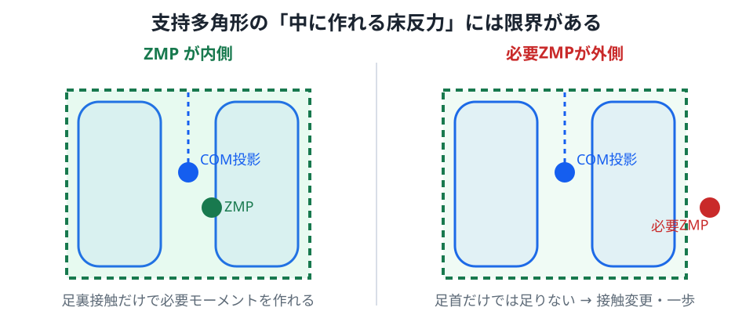

# 06. 支持多角形とZMP

二足ロボットでは、床との接触が制御可能性を決めます。

## 1. 支持多角形

床に接している足裏の接触点を上から見て、その凸包を取ったものを支持多角形と呼びます。

- 両足支持 → 両足を包む広い領域
- 片足支持 → 1枚の足裏程度の狭い領域

歩行では支持領域が周期的に大きく変わります。

*図1：緑の破線領域が支持多角形です。左はZMPを領域内に作れる状態、右は必要なZMPが外へ出ており、現在の足裏接触だけでは要求モーメントを作れない状態です。*

## 2. 静的な条件

静止しているなら、重心の鉛直投影が支持多角形内にあれば、静的には姿勢を保ちやすいと考えられます。

ただし歩行中は加速度があるので、重心投影だけでは足りません。

図1でも、青いCOM投影と緑または赤のZMPは別の点として描いています。動いているときはこの二つが一致するとは限りません。

## 3. ZMPの考え方

ZMP は Zero Moment Point の略です。

床面上で、水平軸まわりの合成モーメントが 0 になる点を考えます。

簡略化された矢状面モデルでは、重心水平位置を $x$、重心高さを $h$、ZMP位置を $p$ とすると、LIPM の関係から

$$
p=x-\frac{h}{g}\ddot{x}
$$

と書けます。

静止して $\ddot{x}=0$ なら

$$
p=x
$$

です。

つまり静的な重心投影条件は、ZMP条件の特別な場合として見られます。

## 4. なぜZMPが支持領域内に必要なのか

足裏接触だけで作れる床反力の作用点には限界があります。

必要なZMPが足裏の外へ出ると、その接触状態のままでは必要な転倒防止モーメントを作れません。

このとき選択肢は、

- 上半身運動を使う
- 別の接触を作る
- 一歩踏み出す

などです。

## 5. 片足支持が難しい理由

両足支持から片足支持になると、支持多角形が急激に小さくなります。

したがって、同じ重心位置でも安全余裕が減ります。

歩行とは、見方を変えると

> 支持領域を自分で移動させながら、転倒を管理する運動

です。

## 実験

[Lab 3: 支持多角形](../labs/03-support-polygon/) では、重心投影点をドラッグし、両足・片足で安定領域がどう変わるか確認できます。

図1を静止画として理解したあと、Lab 3で支持状態を切り替えて動かすと、領域が縮む意味を確認できます。

## 次へ

ZMPと重心加速度の関係をさらに単純化したモデルが[LIPM](07_lipm_step_control.md)です。
