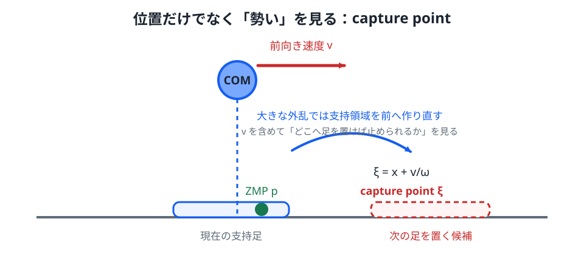

# 07. LIPMとステップ位置制御

> **前提**: 第06章の ZMP 式、2階線形微分方程式、指数関数。
>
> **この章のゴール**: LIPM の運動方程式を ZMP 式から導き、解を安定モード・不安定モードへ分ける。さらに Capture Point が「位置 + 速度」で転倒傾向を見る量であることを理解する。

LIPM（Linear Inverted Pendulum Model）は、二足歩行制御でよく使われる簡略モデルです。

重要なのは、単なる倒立振子の別名ではないことです。

LIPM では

- 重心高さを一定に保つ
- 床反力作用位置 $p$ を操作量として考える
- 重心水平運動へ注目する

ことで、歩行中の重心制御と足運びを扱いやすくします。

*図1：現在位置 $x$ だけでなく速度 $\dot{x}$ が大きいと、Capture Point $\xi$ は前方へ出ます。足裏内の ZMP 移動だけで止められなければ、新しい支持領域を前へ作ります。*

## 1. モデル化の仮定

代表的な仮定は次です。

- 全質量 $m$ を重心の1点へ集中させる
- 重心高さ $h$ は一定
- 脚質量や上半身角運動量を無視する
- 床は水平
- 足は滑らない
- 支持面上の ZMP 位置を $p$ とする

これらはかなり強い仮定です。

その代わり、歩行制御の重要な構造が1本の線形微分方程式へまとまります。

## 2. ZMP式からLIPMを導く

第06章で

$$
p
=
x-\frac{h}{g}\ddot{x}
$$

を導きました。

これを $\ddot{x}$ について解きます。

まず

$$
x-p
=
\frac{h}{g}\ddot{x}
$$

なので

$$
\boxed{
\ddot{x}
=
\frac{g}{h}(x-p)
}
$$

です。

これが LIPM の水平方向の基本式です。

ここで

- $x$: 重心の水平位置
- $\dot{x}$: 重心水平速度
- $\ddot{x}$: 重心水平加速度
- $h$: 一定重心高さ
- $p$: ZMP 位置

です。

第04章では $x$ を状態ベクトルとして使いましたが、この章では文脈を簡潔にするため、$x$ を**スカラーの重心水平位置**として使います。

## 3. 式を直感的に読む

$$
\ddot{x}
=
\frac{g}{h}(x-p)
$$

を見ると、加速度の向きは重心 $x$ と ZMP $p$ の位置関係で決まります。

### $p=x$ のとき

$$
\ddot{x}=0
$$

です。

重心水平速度はそのまま保たれます。

静止しているなら静止し続けますが、前進速度があるならその速度のまま進みます。

### $p<x$ のとき

$$
\ddot{x}>0
$$

なので、重心は前方へ加速します。

### $p>x$ のとき

$$
\ddot{x}<0
$$

なので、重心は後方へ加速します。

前進中なら減速に使えます。

つまり ZMP をどこへ置くかによって、重心水平加速度を制御できます。

## 4. ただしZMPは好きな場所へ置けない

理論式だけなら $p$ は任意の実数に見えます。

しかし実際には

$$
p\in\text{support polygon}
$$

という接触制約があります。

片足支持で足裏が短いなら、$p$ を動かせる範囲も狭いです。

したがって

> もっと前へ ZMP を置けば止まれる

と式が要求しても、足裏がそこまで存在しなければ実現できません。

この「理想的には必要だが、今の接触では作れない」がステップ回復の出発点です。

## 5. 固定ZMPなら倒立振子の式になる

1歩の途中で ZMP を一定 $p$ とします。

支持点から見た相対重心位置を

$$
q=x-p
$$

と置きます。

$p$ が一定なら

$$
\dot{q}=\dot{x}
$$

$$
\ddot{q}=\ddot{x}
$$

なので

$$
\ddot{q}
=
\frac{g}{h}q
$$

です。

ここで

$$
\omega
=
\sqrt{\frac{g}{h}}
$$

と定義すると

$$
\ddot{q}=\omega^2q
$$

となります。

第02章の倒立振子と同じ「符号が正」の不安定方程式です。

## 6. LIPMの厳密解

方程式

$$
\ddot{q}=\omega^2q
$$

の一般解は

$$
q(t)
=
C_+e^{\omega t}
+
C_-e^{-\omega t}
$$

です。

- $C_+e^{\omega t}$: 時間とともに増える不安定モード
- $C_-e^{-\omega t}$: 時間とともに減る安定モード

を表します。

初期位置 $q(0)$ と初期速度 $\dot{q}(0)$ を使えば

$$
q(t)
=
q(0)\cosh(\omega t)
+
\frac{\dot{q}(0)}{\omega}\sinh(\omega t)
$$

と書けます。

ここで

$$
\cosh z
=
\frac{e^z+e^{-z}}{2}
$$

$$
\sinh z
=
\frac{e^z-e^{-z}}{2}
$$

です。

三角関数に似た名前ですが、周期運動ではなく指数関数の組み合わせです。

## 7. 位置だけでは転倒傾向を判断できない

同じ位置 $x$ でも、速度 $\dot{x}$ が違えば将来は変わります。

たとえば重心が支持足の真上でも

$$
x\approx p
$$

かつ

$$
\dot{x}\gg0
$$

なら、前方へ大きな運動量を持っています。

したがって「重心が今どこにあるか」だけでは不十分です。

不安定モードの大きさを、位置と速度から直接取り出したいと考えます。

## 8. Capture Pointを導く

まず

$$
q(t)
=
C_+e^{\omega t}
+
C_-e^{-\omega t}
$$

を微分すると

$$
\dot{q}(t)
=
\omega C_+e^{\omega t}
-
\omega C_-e^{-\omega t}
$$

です。

ここで

$$
q+\frac{\dot{q}}{\omega}
$$

を計算すると

$$
q+\frac{\dot{q}}{\omega}
=
2C_+e^{\omega t}
$$

となります。

安定モード $C_-e^{-\omega t}$ が消え、不安定モードだけが残りました。

$q=x-p$ なので

$$
x-p+\frac{\dot{x}}{\omega}
$$

です。

そこで

$$
\boxed{
\xi
=
x+\frac{\dot{x}}{\omega}
}
$$

を定義します。

これが Capture Point です。

## 9. Capture Pointの時間発展

$\xi$ を微分すると

$$
\dot{\xi}
=
\dot{x}
+
\frac{\ddot{x}}{\omega}
$$

です。

LIPM の式

$$
\ddot{x}=\omega^2(x-p)
$$

を代入すると

$$
\dot{\xi}
=
\dot{x}
+
\omega(x-p)
$$

です。

一方

$$
\omega(\xi-p)
=
\omega\left(
x+\frac{\dot{x}}{\omega}-p
\right)
$$

$$
=
\omega(x-p)+\dot{x}
$$

なので

$$
\boxed{
\dot{\xi}=\omega(\xi-p)
}
$$

です。

$p$ が固定なら

$$
\xi(t)-p
=
\left(\xi(0)-p\right)e^{\omega t}
$$

となります。

つまり $\xi$ は、LIPM の**発散モードを直接表す状態量**です。

## 10. なぜ「Capture Point」なのか

理想 LIPM で、支持点を瞬時に新しい位置 $p_{new}$ へ作れるとします。

もし

$$
p_{new}=\xi(0)
$$

と置けば、その瞬間

$$
\xi-p_{new}=0
$$

です。

すると

$$
\dot{\xi}=0
$$

なので、発散モードを消せます。

残るのは減衰モードで、重心は新しい支持点へ漸近的に近づきます。

このため $\xi$ は直感的に

> 今の位置と速度を考えたとき、どこへ支持点を作ればこの運動を捕まえられるか

を表す点として解釈できます。

## 11. Capture Pointは「未来の足位置の予言」ではない

注意が必要です。

Capture Point の式

$$
\xi=x+\frac{\dot{x}}{\omega}
$$

は

- 一定重心高さ
- 平地
- 角運動量無視
- 瞬時に支持点を変更できる

という理想 LIPM に基づいています。

実機では

- 脚を振る時間が必要
- 着地点に可動域制約がある
- 足裏に面積がある
- 摩擦制約がある
- 上半身運動も使う

ため、$\xi$ をそのまま足位置へ置けば必ず停止できるわけではありません。

それでも「位置だけでなく速度も含める」という考え方は非常に強力です。

## 12. ZMP制御とステップ制御の境界

外乱が小さい場合、Capture Point が現在の支持領域の近くにあり、ZMP を足裏内で動かすだけで回復できることがあります。

しかし外乱が大きく、必要な $p$ が支持領域外へ出ると、足首トルクだけでは足りません。

そこで次の足を前へ出し、新しい支持領域を作ります。

つまり

- 小外乱: 既存の支持領域内で $p$ を動かす
- 大外乱: 支持領域そのものを移動する

という階層になります。

人間が軽く押されたときは足首だけで耐え、強く押されると一歩踏み出すのと同じ構造です。

## 13. 周期歩行の最小モデル

支持点 $p$ を1歩の間は一定とし

$$
q=x-p
$$

を使います。

1歩開始時に

$$
q(0)=-a
$$

時間 $T$ 後に

$$
q(T)=a
$$

へ移る左右対称な歩行を考えます。

厳密解

$$
q(T)
=
q(0)\cosh(\omega T)
+
\frac{\dot{q}(0)}{\omega}\sinh(\omega T)
$$

へ条件を入れると

$$
a
=
-a\cosh(\omega T)
+
\frac{\dot{q}(0)}{\omega}\sinh(\omega T)
$$

です。

したがって

$$
\frac{\dot{q}(0)}{\omega}
=
a
\frac{1+\cosh(\omega T)}{\sinh(\omega T)}
$$

双曲線関数の恒等式

$$
\frac{1+\cosh z}{\sinh z}
=
\coth\left(\frac{z}{2}\right)
$$

を使えば

$$
\boxed{
\dot{q}(0)
=
a\omega
\coth\left(
\frac{\omega T}{2}
\right)
}
$$

となります。

時間 $T$ ごとに支持足を歩幅 $2a$ だけ前へ切り替えると、新しい支持点から見た重心位置は再び $-a$ になります。

Lab 4 の周期歩行は、この最小構造を可視化しています。

## 14. 第1版Lab 4の立位制御則

実験では、目標重心加速度を PD 形で

$$
\ddot{x}_{des}
=
-k_px-k_d\dot{x}
$$

と置きます。

LIPM 式

$$
\ddot{x}
=
\omega^2(x-p)
$$

から必要 ZMP を逆算すると

$$
\omega^2(x-p_{des})
=
\ddot{x}_{des}
$$

なので

$$
\boxed{
p_{des}
=
x-\frac{\ddot{x}_{des}}{\omega^2}
}
$$

です。

ただし $p_{des}$ が足裏を越える場合、実験では支持範囲内へ飽和させます。

そのうえで Capture Point が支持領域を大きく超えた場合、支持中心を前へ移してステップ回復を模擬します。

この実装は

1. 望ましい重心加速度を決める
2. その加速度を作る ZMP を逆算する
3. ZMP が実現可能範囲を越えたら飽和する
4. それでも足りなければステップする

という順序です。

## 実験

[Lab 4: LIPM歩行](../labs/04-lipm-walking/) を開き、外乱を加えてください。

注目する値は3つです。

- COM: $x$
- ZMP: $p$
- Capture Point: $\xi$

観察ポイント:

- 外乱直後、$x$ と $\xi$ のどちらが先に大きく動くか
- 小外乱では $p$ の移動だけで戻れるか
- $p$ が足裏端へ飽和したあと、$\xi$ がどう動くか
- ステップすると支持領域が移り、$\xi$ との位置関係がどう変わるか

「倒れた / 倒れない」だけでなく、**どの制御手段が限界へ達して次の手段へ切り替わったか**を見てください。

## 補講: 安定成分と発散成分に分ける

> ここは LIPM を状態分解として見る発展事項です。

Capture Point に対して

$$
\eta
=
x-\frac{\dot{x}}{\omega}
$$

も定義できます。

$\xi$ と $\eta$ から

$$
x
=
\frac{\xi+\eta}{2}
$$

$$
\dot{x}
=
\frac{\omega}{2}(\xi-\eta)
$$

と元の状態を復元できます。

さらに

$$
\dot{\xi}
=
\omega(\xi-p)
$$

に対し

$$
\dot{\eta}
=
-\omega(\eta-p)
$$

となります。

つまり LIPM は

- $\xi$: 発散する成分
- $\eta$: 収束する成分

へ分解できます。

この $\xi$ は文献によって **Divergent Component of Motion（DCM）** と呼ばれます。

歩行制御では、安定成分より発散成分を重点的に管理する設計が自然になります。

## 補講: Preview control / MPCへ

> ここは、複数歩先を考える制御への入口です。

Capture Point は「今の状態から、次の支持位置をどうするか」を考える強力な道具です。

しかし実際の歩行では

- 次の1歩だけでなく数歩先
- 足を置ける領域
- ZMP の支持多角形制約
- 歩幅・歩行周期
- 入力の滑らかさ

を同時に考えたいことがあります。

このとき、未来の一定区間を予測して入力系列を最適化する **Model Predictive Control（MPC）** が自然に現れます。

LIPM は線形なので、制約付き最適化へ載せやすく、ZMP preview control や歩行 MPC の基礎モデルとして長く使われてきました。

考え方は第05章の LQR とつながっています。

- LQR: 線形系 + 2次コストを無限時間で最適化
- MPC: 有限の予測区間で、入力・状態制約も含めて繰り返し最適化

です。

## 15. ここから実機へ何が増えるか

本格的な二足歩行では、さらに

- 3D LIPM
- 左右方向の安定化
- Preview control / MPC
- 足先軌道生成
- 逆運動学
- 逆動力学
- 全身制御
- 摩擦制約
- 接触切替
- 状態推定
- モータ・関節制約
- 全身角運動量

などが加わります。

しかし

> 倒立振子 → フィードバック → 状態空間 → LQR → 支持領域 → ZMP → LIPM → Capture Point → ステップ

という流れを理解していれば、高度な歩行制御を「突然の公式集」ではなく、同じ問題の拡張として読めるようになります。
