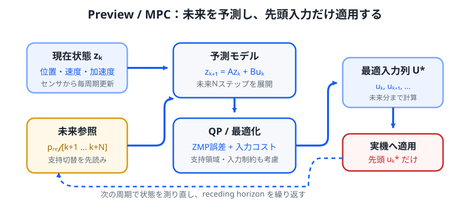

# 補講 S07. Preview Control と MPC

> **なぜ本編から分けるか**: 第07章までは「現在の状態から、今どう立て直すか」を中心に扱います。Preview Control と MPC は、数ステップ先の支持領域や ZMP 目標を使って**未来を見ながら現在の入力を決める**ため、有限時間最適化と離散時間モデルが必要になります。
>
> **この補講のゴール**: LIPM を離散時間化し、未来の ZMP 目標を評価関数へ入れる考え方を理解する。Preview Control と MPC の共通点・違いを整理し、なぜ実機歩行では制約付き MPC が自然に現れるかを説明できるようにする。

第07章の Capture Point は、現在の位置と速度から「このままではどちらへ発散するか」を非常にうまく表します。

しかし歩行では、次の足がいつ着くか、どこまで脚が届くか、左右の支持領域がこれからどう切り替わるかも分かっています。

ならば制御器も、現在だけでなく**既知の未来**を利用した方がよいはずです。

*図1：Preview / MPC の基本構造。未来 $N$ ステップを予測して入力列を最適化しますが、実際に適用するのは先頭の入力だけです。次のサンプル時刻で状態を測り直し、再び最適化します。*

## 1. 反応制御から予測制御へ

第07章では

$$
\ddot{x}=\frac{g}{h}(x-p)
$$

を使いました。

ここで

- $x$: 重心水平位置
- $h$: 一定重心高さ
- $p$: ZMP 位置

です。

この式だけでも、現在の $x,\dot{x}$ から必要な $p$ を考えられます。

しかし歩行中には、たとえば

- 0.2 秒後までは右足支持
- その後 0.1 秒は両足支持
- 次は左足支持

というように、近い未来の支持領域が計画されています。

この情報を使えば

> 今この瞬間だけ姿勢を戻す

のではなく

> 次の支持切替まで含めて、将来の ZMP 誤差が小さくなるように今の入力を決める

ことができます。

これが Preview Control や MPC の中心的な考えです。

## 2. まず連続時間モデルを離散時間へする

計算機の制御器は、サンプル周期 $T$ ごとに状態を更新します。

連続時間の状態方程式

$$
\dot{z}=Az+Bu
$$

を、離散時間では

$$
\boxed{
z_{k+1}=A_d z_k+B_d u_k
}
$$

と書きます。

添字 $k$ は $k$ 回目の制御周期を表します。

厳密には

$$
A_d=e^{AT}
$$

$$
B_d=\int_0^T e^{A\tau}B\,d\tau
$$

ですが、LIPM の Preview Control では別の便利な状態を使うことが多いです。

## 3. 重心 jerk を入力にするモデル

重心位置 $x$ の 3 階微分

$$
u=\dddot{x}
$$

を入力とします。

$u$ は **jerk** と呼ばれ、加速度の変化率です。

状態を

$$
z=
\begin{bmatrix}
x\\
\dot{x}\\
\ddot{x}
\end{bmatrix}
$$

とします。

1 サンプル中は jerk $u_k$ が一定だと仮定すると、積分により

$$
\ddot{x}_{k+1}
=
\ddot{x}_k+Tu_k
$$

$$
\dot{x}_{k+1}
=
\dot{x}_k+T\ddot{x}_k+\frac{T^2}{2}u_k
$$

$$
x_{k+1}
=
x_k+T\dot{x}_k+\frac{T^2}{2}\ddot{x}_k+\frac{T^3}{6}u_k
$$

です。

したがって

$$
\boxed{
z_{k+1}
=
Az_k+Bu_k
}
$$

$$
A=
\begin{bmatrix}
1&T&T^2/2\\
0&1&T\\
0&0&1
\end{bmatrix}
$$

$$
B=
\begin{bmatrix}
T^3/6\\
T^2/2\\
T
\end{bmatrix}
$$

となります。

## 4. ZMP は状態から計算できる

LIPM の ZMP 式は

$$
p=x-\frac{h}{g}\ddot{x}
$$

でした。

状態 $z$ を使えば

$$
\boxed{
p=Cz
}
$$

$$
C=
\begin{bmatrix}
1&0&-h/g
\end{bmatrix}
$$

と書けます。

つまり jerk $u$ を選ぶと、将来の

- 重心位置
- 速度
- 加速度
- ZMP

が一括して予測できます。

## 5. 未来を N ステップ予測する

現在を $k$ とします。

1 ステップ先は

$$
z_{k+1}=Az_k+Bu_k
$$

です。

2 ステップ先は

$$
z_{k+2}
=A^2z_k+ABu_k+Bu_{k+1}
$$

です。

同じ操作を繰り返すと、$N$ ステップ先までの状態は

$$
U=
\begin{bmatrix}
u_k\\
u_{k+1}\\
\vdots\\
u_{k+N-1}
\end{bmatrix}
$$

という入力列の線形関数として書けます。

さらに $p=Cz$ なので、将来 ZMP 列

$$
P=
\begin{bmatrix}
p_{k+1}\\p_{k+2}\\\vdots\\p_{k+N}
\end{bmatrix}
$$

も

$$
\boxed{
P=Fz_k+GU
}
$$

という形へまとめられます。

$F,G$ は $A,B,C$ と予測長 $N$ から作る行列です。

この式が Preview / MPC の計算上の核心です。

## 6. Preview Control の評価関数

未来の目標 ZMP を

$$
P^{ref}=
\begin{bmatrix}
p^{ref}_{k+1}\\
p^{ref}_{k+2}\\
\vdots\\
p^{ref}_{k+N}
\end{bmatrix}
$$

とします。

たとえば右足支持中なら右足中央付近、両足支持では両足の間、次の左足支持では左足付近へ参照を移します。

最も単純な評価関数は

$$
\boxed{
J
=
q_p\sum_{i=1}^{N}
\left(p_{k+i}-p^{ref}_{k+i}\right)^2
+
q_u\sum_{i=0}^{N-1}u_{k+i}^2
}
$$

です。

第1項は

> ZMP を未来の目標へ追従させたい

という要求です。

第2項は

> jerk を極端に大きくして重心をガクガク動かしたくない

という要求です。

これは第05章の LQR と同じ「状態誤差と入力のトレードオフ」という考え方です。

## 7. なぜ未来の参照を先読みすると歩行が滑らかになるのか

もし制御器が現在の ZMP 誤差だけを見るなら、支持脚が切り替わった**後**に初めて新しい目標へ反応します。

一方 Preview Control は、数百 ms 後に支持領域が移動することを知っています。

そのため支持切替より前から重心運動を少しずつ準備できます。

これは自動車で言えば

- カーブへ入ってから急ハンドルを切る

のではなく

- 前方の道路形状を見て、カーブ前から姿勢を作る

ことに近いです。

## 8. Preview Control と有限時間 LQR

制約がなく、モデルが線形で、評価関数が二次形式なら、上の問題は有限時間の線形二次最適制御です。

つまり Preview Control は LQR とまったく別世界の制御ではありません。

違いは主に

- 未来の参照列を明示的に使う
- 有限の予測区間を考える
- 歩行パターン生成と結びついている

ことです。

将来参照の影響は、最適解を整理すると「preview gain」として現在入力へ現れます。

## 9. では MPC は何が違うのか

MPC は Model Predictive Control の略です。

基本構造は同じです。

1. 現在状態を測る
2. モデルで未来を予測する
3. 入力列を最適化する
4. 最初の入力だけ適用する
5. 次の周期で状態を測り直す

この方式を **receding horizon** と呼びます。

大きな違いは、MPC が不等式制約を非常に自然に扱えることです。

## 10. 二足歩行では制約が主役になる

たとえば ZMP は

$$
p_{min,k}
\le
p_k
\le
p_{max,k}
$$

を満たす必要があります。

これは支持領域の制約です。

さらに実機では

$$
|u_k|\le u_{max}
$$

$$
|\dot{x}_k|\le v_{max}
$$

のような重心運動制約や、足位置について

$$
s_{min}
\le
s_{j+1}-s_j
\le
s_{max}
$$

のような到達可能範囲も入ります。

摩擦制約まで含めれば、S06 で扱った contact wrench の制約も加わります。

## 11. MPC を QP として書く

線形モデルと二次評価関数、線形等式・不等式制約を使うと、最適化は

$$
\boxed{
\begin{aligned}
\min_U\quad &\frac12 U^T H U+f^T U\\
\text{subject to}\quad
&A_{ineq}U\le b_{ineq}
\end{aligned}
}
$$

という **Quadratic Programming; QP** になります。

$H$ は二次コストを表す行列、$f$ は現在状態や参照列の影響を含むベクトルです。

二足歩行制御で QP が頻出する理由の一つはここにあります。

## 12. 「最適な未来」を全部そのまま実行しない

MPC では $N$ ステップ分を最適化しますが、実際に使うのは

$$
u_k^*
$$

だけです。

次の時刻ではセンサから新しい状態 $z_{k+1}$ を得て、また最適化します。

これにより

- 外乱
- モデル誤差
- センサ更新
- 実際の着地ずれ

へ繰り返し修正できます。

最初に作った未来計画を盲目的に最後まで実行する open-loop 最適化とは異なります。

## 13. Capture Point と MPC は競合しない

Capture Point は LIPM の発散状態を非常に小さな式で表します。

一方 MPC は

- 複数ステップ先
- 支持切替
- 入力制約
- 足位置制約

を同時に扱えます。

そのため実装では

- Capture Point / DCM を状態や目標量として使う
- その未来軌道を MPC で最適化する

という組み合わせも自然です。

「Capture Point か MPC か」という二者択一ではありません。

## 14. 予測長 N を長くすれば常によいわけではない

予測長を長くすると未来を広く見られます。

しかし

- QP が大きくなる
- 遠い未来ほどモデル誤差が蓄積する
- 足接触計画そのものが未確定になる

という問題もあります。

したがって実機では、制御周期内に確実に解ける計算量と、必要な先読み時間の折り合いを取ります。

## 15. infeasible とは何か

制約付き MPC では、条件を全部同時に満たせないことがあります。

たとえば

- 足は 20 cm までしか前へ出せない
- ZMP は足裏外へ出せない
- 重心速度がすでに大きすぎる

なら、数学的にも停止可能な入力列が存在しないかもしれません。

この状態を **infeasible** と呼びます。

実機では

- 一部制約へ slack 変数を入れる
- ステップを追加する
- 支持時間を変更する
- 上半身角運動量を使う

など、より広い自由度へ逃がします。

この話は S08、S09 へつながります。

## 16. LIPM の限界が次のモデルを要求する

ここまでの MPC は、未来を賢く使っていてもモデル自体は LIPM です。

そのため

- 重心高さ一定
- 質点近似
- 全身角運動量をほぼ無視

という制約は残っています。

実際のヒューマノイドは腕や胴体も振り、複数の接触力を使います。

そこで次は

> 多リンクロボット全体を、重心と運動量という少数の量でまとめる

**centroidal dynamics** を導入します。

[補講 S08 — Centroidal Dynamics](S08_centroidal_dynamics.md)

## まとめ

- Preview Control は既知の未来参照を利用する。
- LIPM を離散化すれば、未来の ZMP を入力列の線形関数として予測できる。
- 二次評価関数なら有限時間 LQR と同じ数学構造を持つ。
- MPC は receding horizon で毎周期解き直す。
- 支持領域、入力、足位置などの不等式制約を自然に扱える。
- 線形モデル + 二次コスト + 線形制約なら QP になる。
- LIPM のモデル限界を越える次の段階が centroidal dynamics である。
