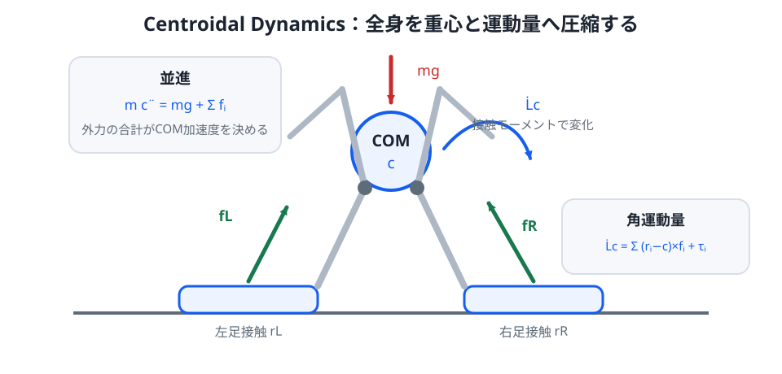

# 補講 S08. Centroidal Dynamics

> **なぜ本編から分けるか**: LIPM は二足歩行の本質を非常に小さな式で見せてくれますが、実機ヒューマノイドでは腕・胴体・脚の運動量や複数接触を無視できません。Centroidal Dynamics は、多リンク全身モデルをそのまま最適化する前に、**重心と全身運動量へ圧縮して扱う中間層**です。
>
> **この補講のゴール**: 全身の並進運動と角運動を、重心位置と centroidal momentum で記述する。LIPM / ZMP がどの仮定から出てくるかを逆向きに理解し、MPC と Whole-Body Control の間をつなぐ役割を説明できるようにする。

LIPM ではロボット全体を1つの質点へまとめました。

これは非常に強力ですが、実機では

- 腕を振る
- 胴体を回す
- 片足・両足・手など複数点で接触する
- 重心高さが変わる

といった効果が重要になります。

一方、全関節の運動方程式をそのまま歩行計画に使うと、状態数が一気に増えます。

その中間として

> 全身の細かな関節運動は一旦まとめ、重心運動と全身運動量だけを見る

のが centroidal dynamics です。

*図1：各接触点の力 $f_i$ とモーメント $\tau_i$ が、重心加速度と重心まわり角運動量の変化を決めます。関節数が多くても、この外力バランス自体は低次元です。*

## 1. まず重心の並進運動

ロボット全質量を $m$、重心位置を

$$
c=
\begin{bmatrix}
c_x\\c_y\\c_z
\end{bmatrix}
$$

とします。

各接触点 $i$ で環境から受ける力を $f_i$ とします。

Newton の第2法則より、全身の重心運動は

$$
\boxed{
m\ddot{c}=mg+\sum_i f_i
}
$$

です。

ここで $g$ は重力加速度ベクトルです。

たとえば上向きを $z$ 正方向とすると

$$
g=
\begin{bmatrix}
0\\0\\-g_0
\end{bmatrix}
$$

と書けます。

重要なのは、内部関節力がこの式に直接現れないことです。

ロボット内部で脚が胴体を押し、胴体が脚を押しても、それらは作用反作用で打ち消し合います。

重心の並進運動を変えるのは、重力と外部接触力です。

## 2. 全身の角運動量

次に重心 $c$ まわりの全身角運動量を

$$
L_c
$$

とします。

接触点位置を $r_i$、その点で受ける力を $f_i$、接触モーメントを $\tau_i$ とすると

$$
\boxed{
\dot{L}_c
=
\sum_i
(r_i-c)\times f_i
+
\sum_i \tau_i
}
$$

です。

重力は重心に作用するとみなせるため、重心まわりモーメントには現れません。

この式は

> どこで、どの向きに床を押すか

が全身角運動量の変化を決めることを表します。

## 3. Centroidal Momentum

全身の線形運動量は

$$
l=m\dot{c}
$$

です。

重心まわり角運動量 $L_c$ とまとめて

$$
\boxed{
h_G=
\begin{bmatrix}
l\\L_c
\end{bmatrix}
}
$$

と置きます。

これを **centroidal momentum** と呼びます。

6 次元ベクトルで

- 上3成分: 線形運動量
- 下3成分: 角運動量

です。

## 4. Contact wrench でまとめる

接触点 $i$ の力とモーメントを

$$
w_i=
\begin{bmatrix}
f_i\\\tau_i
\end{bmatrix}
$$

とまとめます。

すると centroidal momentum の時間変化は

$$
\dot{h}_G
=
\text{gravity wrench}
+
\sum_i \text{contact wrench}_i
$$

という形になります。

厳密な座標変換を省略して書けば

$$
\boxed{
\dot{h}_G
=
\sum_i
\begin{bmatrix}
f_i\\(r_i-c)\times f_i+\tau_i
\end{bmatrix}
+
\begin{bmatrix}
mg\\0
\end{bmatrix}
}
$$

です。

S06 で学んだ friction cone や CoP 制約は、まさにこの $w_i$ に対する制約です。

## 5. LIPM は centroidal dynamics の特殊ケース

ここが重要です。

LIPM は centroidal dynamics と無関係な別モデルではありません。

強い仮定を置くと、centroidal dynamics から LIPM が出てきます。

### 仮定1: 重心高さ一定

$$
c_z=h
$$

$$
\ddot{c}_z=0
$$

とします。

鉛直方向では

$$
f_z=mg
$$

です。

### 仮定2: 重心まわり角運動量変化を無視

$$
\dot{L}_c\approx0
$$

とします。

### 仮定3: 平面運動に限定

前後方向 $x$ だけを見ます。

床反力作用点を $p$ とすると、重心まわりのモーメント釣り合いから

$$
(x-p)f_z-hf_x\approx0
$$

です。

ここで

$$
f_x=m\ddot{x}
$$

$$
f_z=mg
$$

を代入すると

$$
(x-p)mg-hm\ddot{x}=0
$$

よって

$$
\boxed{
p=x-\frac{h}{g}\ddot{x}
}
$$

が得られます。

第06章の ZMP 式そのものです。

つまり LIPM は

> centroidal dynamics から、重心高さ変化と角運動量変化を落としたモデル

と見ることができます。

## 6. 腕を振ると何が変わるか

LIPM では

$$
\dot{L}_c\approx0
$$

としました。

しかし人間もロボットも、外乱を受けると腕や胴体を回して姿勢を立て直します。

すると

$$
\dot{L}_c\neq0
$$

です。

このとき ZMP と重心加速度の単純な関係

$$
p=x-\frac{h}{g}\ddot{x}
$$

には補正項が必要になります。

直感的には

> 足首だけで作れないモーメントの一部を、上半身の角運動量変化で作る

ことができます。

これが「hip strategy」や上半身を使った外乱回復を理解する入口です。

## 7. 複数接触も自然に扱える

両足支持なら接触力は

$$
f_L,
\quad
f_R
$$

の2本あります。

手すりへ手をつけば

$$
f_{hand}
$$

も加わります。

重心並進運動は

$$
m\ddot{c}
=
mg+f_L+f_R+f_{hand}
$$

です。

角運動量変化も各接触点のモーメントを足し合わせればよいです。

したがって centroidal dynamics は

- 片足支持
- 両足支持
- 手を使う接触
- 膝や肘をつく接触

を同じ形式で書けます。

## 8. 接触力をどう分配するか

両足支持で必要な合力

$$
f_L+f_R=f^{des}
$$

が決まっても、左右へどう分配するかは一意ではありません。

たとえば

$$
f_L=0.5f^{des}
$$

$$
f_R=0.5f^{des}
$$

でもよいし、重心が右寄りなら右足へ多く載せてもよいです。

ただし各足には

- $f_z\ge0$
- friction cone
- CoP が足裏内

という制約があります。

そのため接触力分配自体が最適化問題になります。

## 9. Centroidal MPC

S07 の MPC では LIPM を予測モデルにしました。

より実機寄りには、予測状態として

- 重心位置 $c$
- 重心速度 $\dot{c}$
- centroidal momentum $h_G$

を使い、入力として

- 各接触点の力 $f_i$
- 各接触モーメント $\tau_i$
- 場合によっては足位置

を最適化します。

たとえば評価関数に

$$
\|c-c^{ref}\|_{Q_c}^2
$$

$$
\|h_G-h_G^{ref}\|_{Q_h}^2
$$

$$
\sum_i\|f_i-f_i^{ref}\|_{R_f}^2
$$

を入れます。

ここで

$$
\|v\|_Q^2=v^TQv
$$

です。

## 10. ただし centroidal dynamics だけでは関節角は決まらない

これは非常に重要です。

centroidal dynamics が

> 重心をこの加速度で動かし、全身角運動量をこのように変えたい

と決めても

- 膝をどれだけ曲げるか
- 腕をどの姿勢にするか
- 足先姿勢をどう保つか

までは一意に決まりません。

同じ重心運動を実現する関節姿勢は多数存在します。

つまり centroidal dynamics は全身運動の**必要条件を低次元でまとめる層**ですが、関節レベルの解を直接与えるわけではありません。

## 11. Centroidal Momentum Matrix

多リンクロボットの一般化座標を $q$、一般化速度を $\dot{q}$ とします。

centroidal momentum は

$$
\boxed{
h_G=A_G(q)\dot{q}
}
$$

と書けます。

$A_G(q)$ を **Centroidal Momentum Matrix; CMM** と呼びます。

これは

> 各関節速度が、全身の線形・角運動量へどれだけ寄与するか

を表す行列です。

この式を微分すると

$$
\dot{h}_G
=
A_G(q)\ddot{q}
+
\dot{A}_G(q,\dot{q})\dot{q}
$$

です。

この関係は、次の Whole-Body QP で centroidal 目標を関節加速度へ落とし込むときに使えます。

## 12. Planner と Whole-Body Controller の中間層

実機制御を大きく分けると

1. 足接触計画を決める
2. centroidal MPC で重心・運動量・接触力を計画する
3. Whole-Body Controller が関節加速度・トルクへ変換する

という階層を取れます。

Centroidal dynamics はこの 2 と 3 をつなぐ共通言語になります。

## 13. なぜ最初から全身モデル MPC にしないのか

理論上は、全関節を状態に含む非線形 MPC も考えられます。

しかし

- 状態次元が大きい
- 接触切替がある
- 非線形性が強い
- 高速周期で解く必要がある

ため計算が重くなります。

Centroidal model は

- 外力バランスを保つ
- 多接触を扱える
- LIPM より自由度が高い
- 全身モデルより低次元

という妥協点です。

## 14. 実機制御で何を centroidal 層へ任せるか

典型的には centroidal 層で

- 重心軌道
- 全身角運動量
- 左右足の接触力分配
- 次の足位置

を決めます。

一方、関節層で

- 足裏姿勢
- 膝角度
- 腕姿勢
- 関節トルク制限
- 自己衝突回避

などを満たします。

この役割分担が次の Whole-Body QP です。

[補講 S09 — Whole-Body QP制御](S09_whole_body_qp.md)

## まとめ

- 全身重心は $m\ddot{c}=mg+\sum f_i$ に従う。
- 重心まわり角運動量は接触点のモーメントで変化する。
- 線形運動量と角運動量をまとめたものが centroidal momentum である。
- LIPM / ZMP は、一定重心高さ・角運動量変化無視などを置いた特殊ケースとして理解できる。
- Centroidal dynamics は多接触・上半身運動を LIPM より自然に扱える。
- ただし関節姿勢や関節トルクは一意に決まらない。
- centroidal 目標を全身関節へ実現する次の層が Whole-Body QP である。
