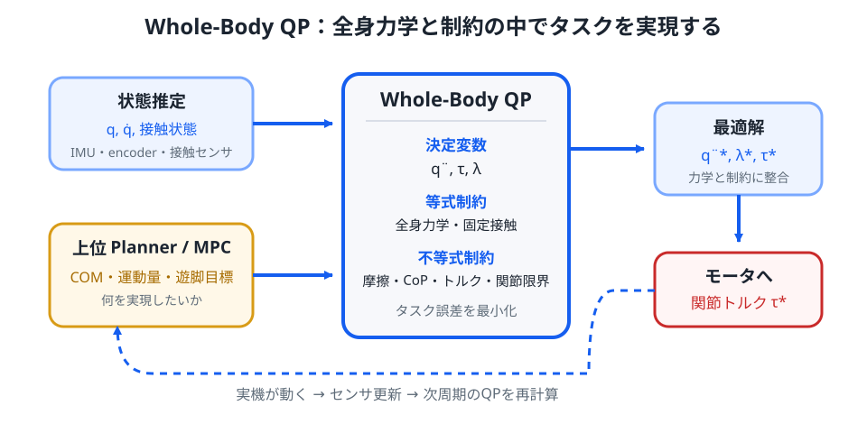

# 補講 S09. Whole-Body QP制御

> **なぜ本編から分けるか**: Centroidal Dynamics までで「重心・運動量・接触力をどうしたいか」は記述できます。しかし実機では、その要求を数十個の関節加速度・関節トルクへ落とし込まなければなりません。Whole-Body Control は、全身剛体力学と接触制約を同時に満たす関節レベル制御です。
>
> **この補講のゴール**: 多リンクロボットの運動方程式を制約として使い、重心・足先・姿勢などのタスクを二次計画問題へまとめる流れを理解する。重み付き QP、slack、階層型 QP の意味と、Centroidal MPC との役割分担を説明できるようにする。

歩行計画器が

- 重心を前へ $0.4\,\mathrm{m/s^2}$ 加速したい
- 左足へこの床反力を出したい
- 右足を次の着地点へ運びたい
- 胴体は水平に保ちたい

と要求したとします。

問題は、それを**どの関節をどれだけ動かして実現するか**です。

Whole-Body QP は、これらを1つの最適化問題として毎制御周期解きます。

*図1：上位層は「何を実現したいか」を与え、Whole-Body QP は「全身力学と制約を破らず、どの関節トルクで実現するか」を解きます。*

## 1. 全身剛体力学を思い出す

S05 で、多リンクロボットの一般化座標を $q$ とすると運動方程式は概念的に

$$
M(q)\ddot{q}+h(q,\dot{q})
=
\tau_{gen}
$$

と書けることを見ました。

浮遊ベース型ヒューマノイドでは、床との接触力も入れて

$$
\boxed{
M(q)\ddot{q}+h(q,\dot{q})
=
S^T\tau+J_c(q)^T\lambda
}
$$

と書きます。

ここで

- $M(q)$: 慣性行列
- $h(q,\dot{q})$: Coriolis・遠心・重力項など
- $\tau$: 駆動関節トルク
- $S$: 駆動関節を取り出す選択行列
- $J_c$: 接触点 Jacobian
- $\lambda$: 接触 wrench / 接触力

です。

浮遊ベースの位置・姿勢には直接モータがないため、$S$ が必要になります。

## 2. Whole-Body QP の決定変数

代表的には

$$
\boxed{
z=
\begin{bmatrix}
\ddot{q}\\
\tau\\
\lambda
\end{bmatrix}
}
$$

を最適化変数にします。

つまり毎周期

> 関節加速度、関節トルク、床反力を同時に決める

わけです。

実装によっては $\tau$ を消去し

$$
z=[\ddot{q},\lambda]
$$

だけを最適化する場合もあります。

## 3. 運動方程式は「希望」ではなく等式制約

全身運動方程式は破ってよいタスクではありません。

したがって

$$
M\ddot{q}+h-S^T\tau-J_c^T\lambda=0
$$

を

$$
\boxed{
A_{dyn}z=b_{dyn}
}
$$

という**等式制約**として QP に入れます。

これにより最適化結果は、少なくともモデル上は Newton–Euler / Lagrange 力学と整合します。

## 4. 接触している足は床を突き抜けない

足裏が床へ固定され、滑りも離陸もしていないとします。

接触点速度は

$$
J_c(q)\dot{q}=0
$$

です。

時間微分すると

$$
J_c(q)\ddot{q}
+
\dot{J}_c(q,\dot{q})\dot{q}
=0
$$

です。

したがって

$$
\boxed{
J_c\ddot{q}
=-\dot{J}_c\dot{q}
}
$$

も等式制約になります。

これを入れなければ、QP が「支持足を床の中へ加速する」ような非物理的解を選ぶ可能性があります。

## 5. タスクは Jacobian で加速度へ落とす

たとえば手先位置を $x_e(q)$ とします。

速度は

$$
\dot{x}_e=J_e(q)\dot{q}
$$

です。

さらに微分すると

$$
\ddot{x}_e
=
J_e\ddot{q}
+
\dot{J}_e\dot{q}
$$

です。

手先に望ましい加速度 $\ddot{x}_e^{des}$ があるなら

$$
J_e\ddot{q}
+
\dot{J}_e\dot{q}
\approx
\ddot{x}_e^{des}
$$

となるようにしたいです。

したがってコストへ

$$
\left\|
J_e\ddot{q}
+
\dot{J}_e\dot{q}
-
\ddot{x}_e^{des}
\right\|_{W_e}^2
$$

を入れられます。

## 6. 重心タスク

重心位置を $c(q)$ とすると

$$
\ddot{c}
=
J_c^{COM}\ddot{q}
+
\dot{J}_c^{COM}\dot{q}
$$

です。

上位 MPC が望ましい重心加速度

$$
\ddot{c}^{des}
$$

を出したなら

$$
J_c^{COM}\ddot{q}
+
\dot{J}_c^{COM}\dot{q}
\approx
\ddot{c}^{des}
$$

をタスクにします。

評価関数は

$$
J_{COM}
=
\left\|
J_c^{COM}\ddot{q}
+
\dot{J}_c^{COM}\dot{q}
-
\ddot{c}^{des}
\right\|_{W_{COM}}^2
$$

です。

## 7. Swing foot タスク

遊脚足先位置を $x_{sw}(q)$ とします。

着地点計画から

$$
x_{sw}^{ref}(t),
\quad
\dot{x}_{sw}^{ref}(t),
\quad
\ddot{x}_{sw}^{ref}(t)
$$

が与えられているとします。

追従誤差を戻すため、望ましい加速度を

$$
\ddot{x}_{sw}^{des}
=
\ddot{x}_{sw}^{ref}
+K_d(\dot{x}_{sw}^{ref}-\dot{x}_{sw})
+K_p(x_{sw}^{ref}-x_{sw})
$$

と作れます。

すると Whole-Body QP は

$$
J_{sw}\ddot{q}
+
\dot{J}_{sw}\dot{q}
\approx
\ddot{x}_{sw}^{des}
$$

を満たす関節加速度を探します。

ここでも PD 制御が、タスク空間の望ましい加速度生成として再登場します。

## 8. 姿勢タスク

胴体姿勢、骨盤姿勢、頭部姿勢なども同様です。

厳密な3次元姿勢誤差は回転行列や quaternion を使いますが、局所的には

$$
\dot{\omega}
\approx
\dot{\omega}^{des}
$$

のような角加速度追従タスクへできます。

Whole-Body Control では

- 重心
- 胴体姿勢
- 遊脚
- 腕
- 視線

など多数のタスクを同時に扱います。

## 9. Centroidal momentum タスク

S08 で

$$
h_G=A_G(q)\dot{q}
$$

を導入しました。

微分すると

$$
\dot{h}_G
=
A_G\ddot{q}
+
\dot{A}_G\dot{q}
$$

です。

上位 centroidal MPC が

$$
\dot{h}_G^{des}
$$

を与えるなら

$$
A_G\ddot{q}
+
\dot{A}_G\dot{q}
\approx
\dot{h}_G^{des}
$$

をタスクとして入れられます。

これが centroidal 層から whole-body 層への直接的な接続です。

## 10. タスクを全部足すと QP になる

複数タスクを重み付きで足します。

たとえば

$$
\boxed{
\begin{aligned}
J(z)
={}&
\|a_{COM}(z)-a_{COM}^{des}\|_{W_{COM}}^2\\
&+\|a_{sw}(z)-a_{sw}^{des}\|_{W_{sw}}^2\\
&+\|\dot{h}_G(z)-\dot{h}_G^{des}\|_{W_h}^2\\
&+\|\tau\|_{W_\tau}^2
\end{aligned}
}
$$

です。

各タスクが $z$ の線形関数なら

$$
J(z)
=
\frac12 z^THz+f^Tz+\text{const.}
$$

へ整理できます。

したがって QP になります。

## 11. 摩擦制約

S06 の Coulomb 摩擦は

$$
\sqrt{f_x^2+f_y^2}
\le
\mu f_z
$$

でした。

これは円錐なので、そのままでは二次円錐制約です。

高速な QP へ入れるため、摩擦円錐を多角形で近似して

$$
|f_x|\le\mu f_z
$$

$$
|f_y|\le\mu f_z
$$

のような **friction pyramid** を使うことがあります。

これなら線形不等式

$$
A_f\lambda\le b_f
$$

へできます。

## 12. 法線力は負になれない

床は足を引っ張れないので

$$
\boxed{
f_z\ge0
}
$$

です。

この unilateral contact 条件も QP の不等式制約です。

足が離陸する区間では、その接触自体を contact set から外します。

## 13. CoP 制約

足裏 wrench

$$
\lambda=
\begin{bmatrix}
f_x&f_y&f_z&\tau_x&\tau_y&\tau_z
\end{bmatrix}^T
$$

から CoP は概念的に

$$
p_x\propto-\frac{\tau_y}{f_z}
$$

$$
p_y\propto\frac{\tau_x}{f_z}
$$

で決まります。

CoP を足裏矩形内へ置く条件は、$f_z>0$ の範囲では wrench に対する線形不等式へ変形できます。

したがって S06 の接触条件がそのまま Whole-Body QP の制約へ入ります。

## 14. 関節トルク制限

モータには限界があります。

$$
\boxed{
\tau_{min}
\le
\tau
\le
\tau_{max}
}
$$

を入れます。

この制約がないと、最適化は理論上どれだけ大きなトルクでも使ってタスク誤差を小さくしようとします。

## 15. 関節位置・速度制限

現在の関節角 $q_k$ と速度 $\dot{q}_k$ から、短い時間 $T$ 後を予測して

$$
q_{k+1}
\approx
q_k+T\dot{q}_k+\frac{T^2}{2}\ddot{q}_k
$$

とします。

これに

$$
q_{min}\le q_{k+1}\le q_{max}
$$

を課せば、関節端へ突っ込む加速度を抑えられます。

速度制限も

$$
\dot{q}_{k+1}
\approx
\dot{q}_k+T\ddot{q}_k
$$

から作れます。

## 16. 完全な形

代表的な Whole-Body QP は

$$
\boxed{
\begin{aligned}
\min_z\quad
&\frac12z^THz+f^Tz\\
\text{subject to}\quad
&A_{dyn}z=b_{dyn}\\
&A_{contact}z=b_{contact}\\
&A_{ineq}z\le b_{ineq}
\end{aligned}
}
$$

です。

ここで

- $A_{dyn}z=b_{dyn}$: 全身力学
- $A_{contact}z=b_{contact}$: 固定接触の加速度条件
- $A_{ineq}z\le b_{ineq}$: 摩擦、CoP、トルク、関節制限

です。

## 17. 重み付き QP の弱点

重みで優先順位を付ける場合、たとえば

$$
W_{COM}=1000
$$

$$
W_{arm}=1
$$

とすれば重心タスクを強く優先できます。

しかし重みの差をいくら大きくしても、数学的には完全な「絶対優先」ではありません。

腕タスクを改善するために、重心タスクをほんの少し悪化させる解が選ばれる可能性があります。

## 18. Hierarchical QP

本当に

1. 接触と力学は絶対に守る
2. 次に重心を最優先
3. その範囲で遊脚
4. さらに余裕があれば腕

という優先順位を作りたい場合、**Hierarchical QP; HQP** を使えます。

上位レベルの最適値を壊さない範囲で、次の QP を解いていきます。

これは null-space projection を使う古典的な task-priority inverse kinematics と同じ思想を、制約付き最適化へ拡張したものです。

## 19. Slack 変数

実機ではすべてのソフトタスクを同時に満たせないことがあります。

そこで

$$
Az-b=s
$$

のように slack $s$ を入れ

$$
\rho\|s\|^2
$$

を大きな罰則でコストへ追加します。

すると「完全には守れないが、できるだけ破らない」という解が得られます。

ただし

- 力学方程式
- 非貫通接触

のような物理法則まで安易に slack 化すると、非物理的な解を許すので注意が必要です。

## 20. infeasible と安全側フォールバック

Whole-Body QP も infeasible になることがあります。

例として

- 必要床反力が friction cone を超える
- 膝が関節端にある
- トルク上限で重心加速度を作れない

などです。

実装では

- ソフトタスクを slack 化
- タスク優先順位を落とす
- 上位 MPC へ「この要求は実現不能」と返す
- 足を追加で踏み出す
- 緊急姿勢へ遷移する

などの処理が必要です。

## 21. 逆運動学との違い

Inverse Kinematics; IK は主に

> 目標姿勢を実現する関節角・速度を求める

問題です。

Whole-Body QP はさらに

- 質量と慣性
- 床反力
- モータトルク
- 摩擦

を含みます。

つまり「形が合う」だけでなく「その運動を物理的に実現できるか」まで扱います。

## 22. 逆動力学との関係

Inverse Dynamics は、望ましい $q,\dot{q},\ddot{q}$ から必要トルクを計算する問題です。

Whole-Body QP は、望ましいタスクが複数あり、接触力にも自由度があり、制約がある状況で

> どの $\ddot{q}$ と $\lambda$ を選び、その結果どの $\tau$ を出すか

まで最適化する constrained inverse dynamics と見ることができます。

## 23. 現代的な歩行制御スタック

ここまでを1本につなぐと

1. **State Estimation** — IMU、encoder、足接触から状態を推定
2. **Footstep / Contact Planner** — どこへ、いつ接触するかを計画
3. **MPC / Centroidal MPC** — 重心、運動量、接触力の未来を最適化
4. **Whole-Body QP** — 全身力学と接触制約を守って関節レベルへ変換
5. **Motor Control** — トルク・電流指令を実機へ出す

という階層になります。

第01章の「倒れそうなら戻す」という単純なフィードバックが、ここでは多層の予測・最適化・制約処理へ発展したことが分かります。

## 24. 各層は完全には独立していない

実機では境界が曖昧なこともあります。

たとえば

- MPC 自体に全身変数を入れる
- Whole-Body QP で接触力目標を再調整する
- 学習器が一部タスクや重みを生成する

などの設計があります。

それでも

> 未来の計画
>
> 外力・運動量の整合
>
> 全身関節レベルの実現

という3つの役割を分けて考えると、複雑な制御系を理解しやすくなります。

## 25. 第07章からここまでの見取り図

第07章では

$$
\xi=x+\frac{\dot{x}}{\omega}
$$

というわずか1本の式で、発散する歩行状態を捉えました。

S07 では未来の支持切替を Preview / MPC へ入れました。

S08 では質点近似を広げ、全身の重心と運動量を扱いました。

S09 では、その目標を実機関節へ実現する QP を導入しました。

つまり

$$
\text{LIPM}
\rightarrow
\text{Preview / MPC}
\rightarrow
\text{Centroidal Dynamics}
\rightarrow
\text{Whole-Body QP}
$$

という流れです。

これは二足歩行制御を、大学初年級の力学から現代ヒューマノイド制御へ接続する重要な一本線です。

## まとめ

- Whole-Body QP は $\ddot{q},\tau,\lambda$ などを同時に決める。
- 全身運動方程式と固定接触条件は等式制約として入る。
- 重心・遊脚・姿勢・centroidal momentum は二次コストとして扱える。
- 摩擦、CoP、トルク、関節制限は不等式制約になる。
- 重み付き QP は柔軟だが、厳密な優先順位には HQP が有効である。
- Slack は infeasible を避けるため有用だが、物理法則を安易に緩めてはいけない。
- Centroidal MPC が「何をしたいか」を決め、Whole-Body QP が「どう全身で実現するか」を解く。
