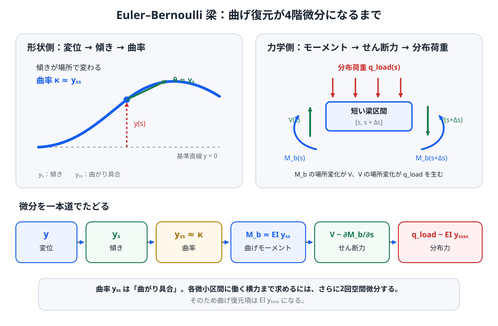

# 補講 S10 — 柔軟ホース境界制御から二足歩行へ

> **対象**: Side Lab X1 を触って、「暴れるホースを手元から抑える話が、なぜ二足歩行制御につながるのか」を整理したい読者。
>
> **前提**: 第03章の P / PD を読んでいること。状態空間・固有値・LQR・接触力学は、この補講から必要な箇所へリンクするので、全部を先に読んでおく必要はありません。
>
> **この補講のゴール**: 柔軟ホース固有の概念である **柔軟体の離散化・内部流による不安定化・境界制御** を理解し、それ以外の制御概念は既存章へつないで、二足歩行との共通点と相違点を説明できるようにする。

[Side Lab X1: Flexible Hose Control](../labs/x1-shower-tvc/) では、内部に水が流れる柔軟ホースを手元から操作します。

最初に結論を言うと、S10 で新しく覚える概念は多くありません。

1. **柔軟体は、1個の角度ではなく「場所ごとの変形」を持つ**
2. **内部を流体が流れると、外力が増えるだけでなく運動方程式そのものが変わる**
3. **手元を動かす操作は、ホースの途中を直接押すのではなく境界条件から全体へ作用する**

固有値、状態空間、可制御性、LQR、CoP / ZMP などは S10 固有の概念ではありません。分からないところだけ、次の既存章へ戻ってください。

| 分からない言葉 | 先に見る場所 | S10 では何に使うか |
| --- | --- | --- |
| 微分方程式の指数成長・減衰 | [補講 S01](S01_ode_exponential_modes.md) | 振動が増える / 減るを読む |
| 固有値・固有モード | [補講 S02](S02_eigenvalues_modes.md) | どの変形パターンが不安定かを見る |
| 安定・漸近安定 | [補講 S03](S03_lyapunov_stability.md) | 「戻る」「発散する」を区別する |
| 状態空間・可制御性 | [第04章](04_state_space.md) | 多数の自由度をまとめて制御する |
| LQR | [第05章](05_lqr.md) | 状態と入力の重みからゲインを決める |
| 一般化座標・多自由度の運動方程式 | [補講 S05](S05_lagrange_robot_dynamics.md) | 多数の変形自由度を行列で表す |
| 摩擦・CoP・接触制約 | [補講 S06](S06_contact_friction_constraints.md) | 二足歩行側の「入力できる範囲」を理解する |
| Preview / MPC | [補講 S07](S07_preview_mpc.md) | 未来の支持切替まで含めて計画する |
| Centroidal Dynamics | [補講 S08](S08_centroidal_dynamics.md) | 全身を重心・運動量へ圧縮する |
| Whole-Body QP | [補講 S09](S09_whole_body_qp.md) | 上位目標を関節トルクへ落とす |

---

## 1. Phase 0 と Phase 1 — 「1個の剛体」から「場所ごとに曲がる物体」へ

Phase 0 は、シャワーヘッド周辺をほぼ単一剛体として扱う比較モデルです。

剛体なら、たとえば角度 $\theta(t)$ と角速度 $\dot{\theta}(t)$ のような少数の変数で姿勢を表せます。

しかし柔軟ホースは違います。

根元は右へ曲がり、中間は左へ曲がり、先端はさらに別の方向へ動くことがあります。つまり必要なのは「ホース全体の角度1個」ではなく、

$$
y(s,t)
$$

のような**場所 $s$ ごとの横変位**です。

ここで

- $s$: 手元から先端までの位置
- $t$: 時間
- $y(s,t)$: 位置 $s$ にあるホース中心線の横変位

です。

このように、状態が空間上に分布しているモデルを **分布定数系** と呼びます。

S10 では分布定数系の一般論までは扱いません。必要なのは、

> 柔軟体では「どこがどれだけ曲がっているか」を複数の自由度で持つ必要がある

という点だけです。

---

## 2. Euler–Bernoulli 梁を最初から作る — なぜ曲げ復元が4階微分なのか

ここからの式で最も突然に見えやすいのが

$$
EI\,y_{ssss}
$$

です。

「曲げると元へ戻る」という説明だけでは、なぜ変位を4回も空間微分するのか分かりません。

そこで、内部流を入れる前に

> **梁 → 傾き → 曲率 → 曲げモーメント → せん断力 → 分布荷重**

を順番に作ります。

*図1：$y_{ss}$ は「曲がり具合」ですが、運動方程式に必要なのは各微小区間へ働く横方向の力です。曲率から曲げモーメント、せん断力、分布荷重まで力のつり合いをたどると、空間4階微分 $y_{ssss}$ が現れます。*

### 2.1 そもそも「梁」とは何か

**梁; beam** は、長さに比べて太さが小さい細長い物体を、主に**曲げ変形**へ注目して表すモデルです。

たとえば

- 定規
- 橋桁
- 釣り竿
- 細い棒
- ホース

などを横から曲げる問題に使います。

実際のシャワーホースには、

- 大きな回転
- 断面のつぶれ
- ねじれ
- ゴム・樹脂の複雑な材料特性

もあります。

Side Lab X1 の線形モデルでは、まずそれらを捨てて

> **細長い物体が、基準となる直線の近くで小さく横へ曲がる**

という最小モデルから始めます。

### 2.2 Euler–Bernoulli 梁とは何か

梁の曲げを記述する代表的な近似が **Euler–Bernoulli 梁理論**です。

このモデルでは主に

- 梁は十分細長い
- 横変位と傾きは小さい
- 曲げる前に平面だった断面は、曲げた後もほぼ平面を保つ
- 断面そのもののせん断変形は小さいとして無視する

と仮定します。

そのため梁の形を、中心線の横変位

$$
y(s,t)
$$

で記述できます。

ここで

- $s$: 梁に沿った位置
- $t$: 時間
- $y(s,t)$: 位置 $s$ における中心線の横変位

です。

「どこにいるか」だけを表す剛体の角度1個とは違い、$y$ は**場所 $s$ ごとに値を持つ関数**です。

### 2.3 空間1階微分 $y_s$ は「傾き」

ある時刻を固定して、梁の形 $y(s)$ を見ます。

$$
y_s
=
\frac{\partial y}{\partial s}
$$

は、その場所で梁がどれくらい傾いているかを表します。

小さな傾きなら、断面の回転角 $\theta$ と

$$
\boxed{
\theta
\approx
y_s
}
$$

とみなせます。

したがって

$$
y
\rightarrow
y_s
$$

は

> **変位 → 傾き**

という1段目です。

### 2.4 2階微分 $y_{ss}$ は「曲率」

斜めの直線は傾いていますが、曲がってはいません。

たとえば

$$
y(s)=as+b
$$

なら

$$
y_s=a
$$

は非ゼロでも、

$$
y_{ss}=0
$$

です。

一方、円弧のような形では場所とともに傾きが変わります。

この「傾きが場所によってどれだけ変わるか」を表す量が**曲率 $\kappa$**です。

厳密な曲率式はもう少し複雑ですが、小さい傾きなら

$$
\boxed{
\kappa
\approx
y_{ss}
}
$$

となります。

ここで初めて

> **梁がどれだけ曲がっているか**

が数式になりました。

### 2.5 曲げモーメントとは何か

次に **モーメント; moment** を考えます。

支点から距離 $r$ の場所へ力 $F$ を加えると、物体を回そうとする作用が生じます。

単純な場合、その大きさは

$$
M=rF
$$

です。

梁を途中で仮想的に切ると、切断面には

> 曲げられた梁を元へ戻そうとする内部の回転作用

が現れます。

これが **曲げモーメント; bending moment** です。

記号を $M_b$ とします。

Euler–Bernoulli 梁では

$$
\boxed{
M_b=EI\kappa
}
$$

です。

小さい傾きなら

$$
\boxed{
M_b
\approx
EIy_{ss}
}
$$

です。

符号は「どちら向きの曲げを正とするか」という規約で逆になることがあります。重要なのは、

> **曲率に比例して、曲げを戻そうとする内部モーメントが生じる**

という関係です。

### 2.6 $E$ と $I$ — 曲げ剛性 $EI$ の中身

$E$ は **Young 率**です。

材料そのものの変形しにくさを表します。同じ形なら、柔らかいゴムより鋼の方が一般に $E$ が大きくなります。

$I$ は **断面二次モーメント; second moment of area** です。

こちらは断面形状による曲げにくさを表します。同じ材料でも、細い棒より断面を大きく取った棒の方が曲げにくくできます。

したがって

$$
\boxed{
EI
}
$$

を **曲げ剛性; flexural rigidity** と呼びます。

単位を確認すると

$$
[E]=\mathrm{N/m^2},
\qquad
[I]=\mathrm{m^4}
$$

なので

$$
[EI]=\mathrm{N\,m^2}
$$

です。

一方、曲率 $y_{ss}$ の単位は $\mathrm{1/m}$ なので

$$
[EIy_{ss}]
=
\mathrm{N\,m}
$$

となります。

これは確かに**モーメントの単位**です。

### 2.7 せん断力とは何か

梁を途中で切ったとき、切断面には曲げモーメントだけでなく、左右の部分が互いに上下へずれないよう支える横方向の内部力も働きます。

これを **せん断力; shear force** と呼び、$V$ と書きます。

短い区間

$$
[s,s+\Delta s]
$$

を取り出します。

左端と右端で曲げモーメントが同じなら、その差による回転作用はありません。

しかし

$$
M_b(s+\Delta s)
\neq
M_b(s)
$$

なら、小区間の回転のつり合いを保つために横向きの力が必要です。

その役割を担うのがせん断力です。

極限を取ると、符号規約を除いて

$$
\boxed{
V
\sim
\frac{\partial M_b}{\partial s}
}
$$

です。

したがって

$$
M_b
\sim
EIy_{ss}
$$

なら

$$
\boxed{
V
\sim
EIy_{sss}
}
$$

です。

ここで3階微分が現れます。

### 2.8 分布荷重とは何か

梁全体へ横向きの力が連続的に掛かっているとします。

単位長さあたりの横力を

$$
q_{\mathrm{load}}(s,t)
$$

と書きます。

単位は

$$
\mathrm{N/m}
$$

です。

これを **分布荷重; distributed load** と呼びます。

短い区間へ掛かる合力は、おおよそ

$$
q_{\mathrm{load}}\Delta s
$$

です。

この横力が存在すると、区間左端と右端のせん断力は同じではいられません。

力のつり合いから、符号規約を除けば

$$
\boxed{
q_{\mathrm{load}}
\sim
\frac{\partial V}{\partial s}
}
$$

となります。

すでに

$$
V
\sim
EIy_{sss}
$$

なので、

$$
\boxed{
q_{\mathrm{load}}
\sim
EIy_{ssss}
}
$$

です。

これが **4階空間微分が現れる理由**です。

### 2.9 なぜ曲率 $y_{ss}$ で終わらないのか

ここが一番重要です。

$$
y_{ss}
$$

は確かに「どれだけ曲がっているか」を表しています。

しかし運動方程式で釣り合わせたいのは、

> **各微小区間に実際に働く横方向の力**

です。

曲率から横力へ行くには

$$
\text{曲率}
\rightarrow
\text{曲げモーメント}
\rightarrow
\text{せん断力}
\rightarrow
\text{分布力}
$$

と進む必要があります。

曲率がすでに2階微分で、そこからさらに2回空間微分するため、

$$
\boxed{
EIy_{ssss}
}
$$

になります。

### 2.10 水なし梁の運動方程式

内部流を入れる前に、まず普通の梁を見ます。

単位長さあたり質量を $m_s$、減衰係数を $c$、外から加わる単位長さあたり横力を $f_{\mathrm{ext}}$ とします。

すると概念的に

$$
\boxed{
m_s y_{tt}
+
c\,y_t
+
EI\,y_{ssss}
=
f_{\mathrm{ext}}
}
$$

と書けます。

各項を言葉にすると

$$
\boxed{
\text{慣性}
+
\text{減衰}
+
\text{曲げ復元}
=
\text{外力}
}
$$

です。

質点ばね系

$$
m\ddot{x}+c\dot{x}+kx=F
$$

と役割は似ています。

違いは、ばねの復元力 $kx$ の代わりに、梁では場所ごとの曲げを表す

$$
EIy_{ssss}
$$

が入ることです。

### 2.11 弦なら2階、梁なら4階

比較のため、張った弦を考えます。

弦の復元力は主に**張力**から生じるので、典型的な波動方程式では

$$
T y_{ss}
$$

のような2階空間微分が現れます。

一方、梁は「曲げモーメント」に抵抗するため、

$$
EIy_{ssss}
$$

という4階微分になります。

つまり

- **弦**: 張力が支配的 → 2階
- **梁**: 曲げ剛性が支配的 → 4階

という違いがあります。

### 2.12 ここで内部流を加える

Side Lab X1 では、梁の内部を流体が平均速度 $U$ で流れます。

そのため、水なし梁の式へ流体の慣性と流れ由来の連成が加わります。

モデルの骨格は

$$
\boxed{
(m_s+m_f)y_{tt}
+
c\,y_t
+
EI\,y_{ssss}
+
2m_fU\,y_{st}
+
m_fU^2\,y_{ss}
=
f_{\mathrm{ext}}
}
$$

です。

ここで

- $m_s$: ホース本体の単位長さあたり質量
- $m_f$: 内部流体の単位長さあたり質量
- $U$: 内部流体の平均流速

です。

ホース内の流路断面積を $A_h$、水の密度を $\rho$ とすれば、

$$
m_f=\rho A_h
$$

です。体積流量を $Q$ とすれば平均流速は

$$
U=\frac{Q}{A_h}
$$

なので、ゲームで「流量を上げる」操作は、この $U$ を通じて運動方程式へ入ります。

また下付き文字は偏微分を省略した記法です。たとえば

$$
y_{ss}
=
\frac{\partial^2y}{\partial s^2},
\qquad
y_{st}
=
\frac{\partial^2y}{\partial s\,\partial t},
\qquad
y_{ssss}
=
\frac{\partial^4y}{\partial s^4}
$$

です。

$y_{st}$ は、場所による傾き $y_s$ が時間とともにどう変化するかを表し、横運動と空間形状の両方を含む量です。

各項は次のように読めます。

#### $(m_s+m_f)y_{tt}$: 構造 + 流体の慣性

ホースだけでなく、中の水も横方向へ加速されるため、質量効果へ加わります。

#### $c\,y_t$: 減衰

材料損失などをまとめた教育用の簡略減衰です。

#### $EI\,y_{ssss}$: 曲げ復元

ここまでで導いた Euler–Bernoulli 梁の曲げ項です。

#### $2m_fU\,y_{st}$: 流れと横運動の速度結合

これは単純な粘性減衰ではありません。

流れている流体とホースの横運動が結び付くことで現れる速度依存の連成です。

$U$ の符号を反転すると、この項の符号も反転します。

#### $m_fU^2\,y_{ss}$: 流速二乗で効く変形結合

こちらは $U^2$ に比例するため、流れの向きを反転しても符号は変わりません。

重要なのは、流速を上げることが

> 外から押す力を強くするだけ

ではないことです。

$U$ が運動方程式の係数そのものへ入り、

> **ホースの固有振動・モード間結合・安定性そのものを変える**

のが Phase 1 の核心です。

---

## 3. 連続体を計算機で扱う — 有限要素法で $q$ へ落とす

連続体のままでは、すべての位置 $s$ について $y(s,t)$ を解かなければなりません。

そこで Side Lab X1 では、ホースを複数の短い要素へ分割します。

これが **有限要素法; FEM** の考え方です。

たとえば各節点について

- 横変位 $y_i$
- 傾き $\theta_i$

を持たせると、

$$
q=
\begin{bmatrix}
y_1 &
\theta_1 &
y_2 &
\theta_2 &
\cdots
\end{bmatrix}^{T}
$$

という有限個のベクトルで形状を近似できます。

この $q$ は「ホース全体の変形を表す座標の一覧」です。

[補講 S05](S05_lagrange_robot_dynamics.md) でロボットの関節角を一般化座標 $q$ にまとめたのと同じ発想です。ただし、

- S05: $q$ は主に関節角や浮遊ベース姿勢
- S10: $q$ はホース節点の横変位・傾き

という違いがあります。

連続体の式をこの有限個の自由度へ写すと、

$$
\boxed{
M\ddot{q}
+
C(U)\dot{q}
+
K(U)q
=
f
}
$$

という行列方程式になります。

ここからは、この式を「記号の塊」にせず読み解きます。

---

## 4. $M\ddot q+C(U)\dot q+K(U)q=f$ は何を言っているのか

まず $q$ が $n$ 次元なら、

- $M$: $n\times n$ 行列
- $C(U)$: $n\times n$ 行列
- $K(U)$: $n\times n$ 行列
- $q,\dot q,\ddot q,f$: $n$ 次元ベクトル

です。

1本の式に見えますが、実際には**各自由度ごとの力のつり合いを $n$ 本まとめたもの**です。

### $M\ddot q$: 「どの形を加速しにくいか」

$M$ は質量行列です。

単なる総質量ではありません。

ある節点を動かすと隣の節点も一緒に動くため、一般には非対角成分も持ちます。

つまり

> 自由度 $i$ の加速度が、自由度 $j$ の慣性力にも影響する

という連成が行列に入っています。

### $K(U)q$: 「どの形から戻ろうとするか」

流れがないときの主成分は曲げ剛性です。

直線状態から曲げた $q$ に対して、元へ戻す力が生じます。

Side Lab X1 では内部流による $U^2$ 項もここへ加わるため、

$$
K(U)
=
K_{\mathrm{bend}}
+
K_{\mathrm{flow}}(U)
$$

という構造になります。

したがって流速を変えると、同じ $q$ でも生じる復元・不安定化作用が変わります。

### $C(U)\dot q$: 「どの速度どうしが結び付くか」

通常の構造減衰に加えて、内部流による速度結合が入ります。

概念的には

$$
C(U)
=
C_{\mathrm{struct}}
+
G_{\mathrm{flow}}(U)
$$

です。

ここで $G_{\mathrm{flow}}(U)$ は単純な「ブレーキ」ではありません。

速度成分どうしを混ぜる流れ由来の項なので、モード間の結合を変え、安定性へ影響します。

### $f$: 右辺は「外から与えた一般化力」

外乱などを、各自由度へ対応する一般化力としてまとめたものです。

ただし Side Lab X1 のプレイヤー入力は、基本的にホース途中へ $f$ を直接与える操作ではありません。

次節の**境界制御**として入ります。

---

## 5. 「モード」とは何か — ホース全体の代表的な曲がり方

多数の自由度 $q$ があると、各節点を1個ずつ追うだけでは挙動を理解しにくくなります。

そこで、系が自然に取りやすい代表的な変形パターンへ分解します。

これが **モード** です。

たとえば

- 1次モード: ホース全体が大きく1回曲がる
- 2次モード: 中間に節を持ち、S字に近く曲がる
- 3次モード: さらに細かく曲がる

というイメージです。

「なぜ固有値と固有ベクトルでその分解ができるのか」は [補講 S02](S02_eigenvalues_modes.md) に任せます。

S10 で必要なのは、

> tip が同じ位置に見えていても、内部では別のモードが大きく振動していることがある

という点です。

これが、先端だけを見る P / PD と内部状態まで見る状態フィードバックの差につながります。

---

## 6. flutter は何か — 「外から周期的に揺すられている」のではない

流量を上げたとき、毎フレーム外から正弦波の力を足しているわけではありません。

無入力の線形化モデルを

$$
\dot{x}=A(U)x
$$

と書くと、流速 $U$ を変えることで行列 $A(U)$ 自体が変わります。

その結果、あるモードの固有値が

$$
\operatorname{Re}(\lambda)<0
$$

から

$$
\operatorname{Re}(\lambda)>0
$$

へ移れば、微小な揺れが自分で増幅するようになります。

指数成長・減衰そのものは [補講 S01](S01_ode_exponential_modes.md)、固有値との対応は [補講 S02](S02_eigenvalues_modes.md) を参照してください。

### flutter と divergence は厳密には別物

流れで不安定になったものを全部 flutter と呼ぶと少し雑です。

- **divergence**: 振動せず、ある変形方向へ静的に崩れていく不安定化
- **flutter**: 振動しながら振幅が成長する不安定化

です。

Side Lab X1 で主に見たいのは後者の振動的不安定化です。

ただし実装上の安定判定は、まず「固有値の実部が正になったか」を見ます。したがって説明では、必要に応じて **flow-induced instability; 流れ誘起不安定** という広い呼び方も使います。

「安定」「漸近安定」の言葉自体が曖昧なら [補講 S03](S03_lyapunov_stability.md) を参照してください。

---

## 7. 境界制御とは何か — ホース途中を押さず、根元を動かす

Side Lab X1 でプレイヤーや制御器が操作するのは、ホース根元の

$$
q_b(t)
=
\begin{bmatrix}
y_{\mathrm{hand}}(t)\\
\theta_{\mathrm{hand}}(t)
\end{bmatrix}
$$

です。

ここで

- $y_{\mathrm{hand}}$: 手元の横位置
- $\theta_{\mathrm{hand}}$: 手元の向き

です。

ホース内部の自由度を $q_f$、手元の境界自由度を $q_b$ として分けると、自由部分の運動方程式は概念的に

$$
M_{ff}\ddot{q}_f
+
C_{ff}\dot{q}_f
+
K_{ff}q_f
=
f_f
-
M_{fb}\ddot{q}_b
-
C_{fb}\dot{q}_b
-
K_{fb}q_b
$$

となります。

右辺の

$$
-M_{fb}\ddot{q}_b
-
C_{fb}\dot{q}_b
-
K_{fb}q_b
$$

が、**根元を動かした影響が自由部分へ伝わる項**です。

### 1自由度のばねで考えると分かりやすい

質点 $x$ が、動く土台 $x_b$ にばね・ダンパでつながっているとします。

$$
m\ddot{x}
+
c(\dot{x}-\dot{x}_b)
+
k(x-x_b)
=
0
$$

を整理すると

$$
m\ddot{x}
+
c\dot{x}
+
kx
=
c\dot{x}_b+kx_b
$$

です。

土台 $x_b$ を動かすだけで、質点へ有効な入力が入ります。

ホースではこれが多自由度へ拡張され、根元の位置・角度が多数の柔軟モードへ伝わります。

これが **boundary control; 境界制御** です。

二足歩行の足裏接触も「境界を通じて身体全体へ力が伝わる」という点では似ていますが、同じ物理現象ではありません。

---

## 8. P / PD — 見えている少数の量だけで戻す

H1-6 の P / PD は、主に

- tip 横変位
- tip 横速度
- tip 角度
- tip 角速度

を使います。

概念的には

$$
u_P=-K_pe
$$

$$
u_{PD}=-K_pe-K_d\dot e
$$

です。

式そのものは [第03章](03_pid_feedback.md) と同じです。

柔軟ホースで難しいのは、**tip が全状態ではない**ことです。

先端の変位が小さくても、中間部では2次・3次モードが振動していることがあります。

したがって PD の限界は、

> D ゲインが弱いから

だけではなく、

> そもそも見ていない内部状態がある

ことからも生じます。

---

## 9. State FB — 内部モードも状態として戻す

状態フィードバックでは、ホース内部の変形・速度と actuator state をまとめて

$$
x=
\begin{bmatrix}
q\\
\dot q\\
x_{\mathrm{act}}
\end{bmatrix}
$$

のような状態ベクトルを作ります。

制御則は、元の平衡点そのものを安定化するだけなら

$u=-Kx$

です。

この式の意味自体は [第04章](04_state_space.md) と同じです。

ただしゲームでは、照準を追うために hand target 自体がゼロから動きます。そこで線形化した離散系

$x_{k+1}=Ax_k+Bu_k+c$

に対し、照準入力 $u_{\mathrm{ref}}$ と整合する定常状態 $x_{\mathrm{ss}}$ を

$(I-A)x_{\mathrm{ss}}=Bu_{\mathrm{ref}}+c$

から求め、

$u=u_{\mathrm{ref}}-K(x-x_{\mathrm{ss}})$

として追従します。

こうして「照準のために意図的に取った姿勢」を、元の平衡点からの誤差としてLQR自身が打ち消すことを避けます。

S10 で重要なのは、状態の数が増えたことに加えて、**動く目標に対して何を参照状態とするか**です。

### 「状態を増やせば全部制御できる」わけではない

入力があるモードへ届かなければ、そのモードをフィードバックしても動かせません。

これが可制御性です。

可制御行列や rank 判定は [第04章](04_state_space.md) に任せます。

ここでは、

> 観測できることと、操作できることは別

と覚えてください。

---

## 10. 「数値線形化」とは何をしているのか

Side Lab X1 の実際のゲーム側モデルには、

- actuator の速度・加速度制限
- target clamp
- 非線形な境界処理
- 大振幅時の補正

などが入るため、全部を最初から1枚のきれいな行列 $A,B$ で書いてはいません。

そこで平衡点近くでは、1ステップの更新則を

$$
x_{k+1}=F(x_k,u_k)
$$

とみなし、各状態・入力をほんの少しずつ変えて

> 次の状態がどれだけ変わるか

を測ります。

その局所的な変化率をまとめると

$$
x_{k+1}
\approx
Ax_k+Bu_k
$$

という線形モデルが得られます。

これが **数値線形化** です。

Taylor 展開の1次近似を、解析式ではなく実装そのものへ小さな摂動を与えて求めている、と考えるとよいです。

その $A,B$ に対して

- 固有値
- 可制御性
- LQR ゲイン

を計算します。

---

## 11. LQR — 「強い入力」ではなく、同じ入力能力の使い方を決める

LQR は

$$
J
=
\sum_k
\left(
x_k^TQx_k
+
u_k^TRu_k
\right)
$$

を小さくするように、状態フィードバックゲイン $K$ を決めます。

詳細は [第05章](05_lqr.md) に任せます。

Side Lab X1 では Human / P / PD / State FB / LQR が、すべて同じ

- hand target 範囲
- 速度上限
- 加速度上限
- difficulty ごとの control authority

を通ります。

ここで **control authority** とは、

> 制御器が物理的・UI 的に使ってよい入力の範囲

くらいの意味です。

したがって LQR が良い結果を出しても、

> LQR だけ手元を2倍速く動かせる

という比較にはしていません。

違いは主に、**同じ入力上限の中で、どの状態をどれだけ見て入力を決めるか**です。

moving bullseye に対しては State FB / LQR に共通して短い参照先読みも使います。現在の実装では 0.12 s 先の既知の照準軌道を参照します。これは actuator authority を増やす処理ではなく、参照軌道に対するtracking lagを補う feedforward 側の処理です。

---

## 12. TVC とは同じではない

Thrust Vector Control; TVC は、ロケットなどで**推力ベクトルの向き**を変え、機体へ力・モーメントを与える制御です。

Flexible Hose Control の不安定化機構は TVC ではありません。

ホース側で支配的なのは

- 柔軟体の曲げ
- 内部を移動する流体
- 流速依存の連成
- 根元境界の運動

です。

共通しているのは物理法則そのものではなく、

> 状態を観測し、限られた入力方向・入力上限の中で不安定な運動を抑える

という**制御問題の構造**です。

「水が出ているから TVC」と理解すると、S10 の一番重要な柔軟体・内部流連成を落としてしまいます。

---

## 13. 二足歩行との接続 — 共通なのは「不安定系 + 入力制約」

ホースと二足歩行は、同じ運動方程式を持つわけではありません。

比較すると次のようになります。

| 系 | 主な状態 | 主な入力 | 入力を制限するもの |
| --- | --- | --- | --- |
| Flexible hose | 節点変位・傾き・速度・hand state | hand 位置・角度 target | hand travel、速度・加速度、流量 |
| 倒立振子 | 角度・角速度 | 支点トルク | トルク上限 |
| LIPM | 重心位置・速度 | ZMP / CoP 位置 | 支持多角形 |
| 実機二足 | 全身姿勢・速度・接触状態 | 関節トルク・接触力 | 摩擦、CoP、トルク、接触切替 |

共通しているのは、

1. 放っておくと増える状態・モードがある
2. 現在状態を観測する
3. その状態へ届く入力を選ぶ
4. 入力上限・接触制約を破らない
5. 成長する運動を抑える

という流れです。

---

## 14. CoP / ZMP は「ホースの hand input」と同じ量ではない

二足歩行では、足裏から好きな力を無制限に出せるわけではありません。

摩擦、法線力、CoP 位置などで床反力の実現可能範囲が決まります。

この接触力学は [補講 S06](S06_contact_friction_constraints.md) にまとめています。

第06章・第07章で使う ZMP / CoP は、

> 床反力をどこへ作用させられるか

を表す概念です。

一方 S10 の hand boundary input は、

> 柔軟体の根元位置・角度をどう動かすか

です。

同じ変数ではありません。

対応しているのは、

> 制御器が「欲しい入力」を好き勝手に出せず、実現可能領域の中で選ばなければならない

という点です。

---

## 15. LIPM / Capture Point との接続

第07章の LIPM は

$$
\ddot{x}
=
\frac{g}{h}(x-p)
$$

です。

ここで

- $x$: 重心水平位置
- $h$: 一定重心高さ
- $p$: ZMP / CoP 位置

です。

Capture Point / DCM は、この系に含まれる**発散成分を低次元で取り出したもの**です。

詳細は [第07章](07_lipm_step_control.md) に任せます。

Flexible hose では発散し得るものが1個とは限らず、複数の柔軟モードがあります。

それでも制御の問いは似ています。

- どのモードが増えているか
- センサからそのモードを知れるか
- hand motion がそのモードへ届くか
- 入力上限内で成長率を負側へ戻せるか

LIPM では支持点 $p$ を動かし、それだけで足りなければステップして支持領域自体を移します。

Flexible hose では hand boundary を動かします。

---

## 16. Side Lab X1 で何を観察すればよいか

[Side Lab X1](../labs/x1-shower-tvc/) で同じ difficulty を選び、Control mode だけを変えてください。

score の順位より、次を見ます。

1. **P → PD**  
   tip 速度を使うことで、振動の収まり方がどう変わるか。

2. **PD → State FB**  
   tip が似た位置でも内部 RMS が違う場面があるか。

3. **State FB → LQR**  
   同じ actuator 上限でも、内部状態の使い方によって hand motion がどう変わるか。

4. **低流量 → 高流量**  
   同じ制御器でも、流速上昇で系そのものが難しくなるか。

5. **飽和表示**  
   失敗が「制御則が悪い」のか「入力能力が足りない」のかを分けて見る。

6. **Human play**  
   うまく抑えたとき、先端だけでなくホース途中の動きを先読みして手を動かしていないか。

なおゲームの「Stable」「flex RMS」は、元の絶対姿勢からの距離ではありません。現在の hand boundary で基準形状を移した **moving hand frame** に対する柔軟変形を測ります。照準のためにホース全体を意図的に傾けたこと自体を「不安定」と数えないためです。

この観察ができれば、S10 の目的は達成です。

---

## 17. ここから現代的な二足歩行制御へ

S10 から先は、ホース側の話を増やすのではなく、二足歩行側へ戻ります。

流れは次の通りです。

$$
\text{LIPM / Capture Point}
\rightarrow
\text{Preview / MPC}
\rightarrow
\text{Centroidal Dynamics}
\rightarrow
\text{Whole-Body QP}
$$

それぞれの役割は次の通りです。

- [補講 S07: Preview / MPC](S07_preview_mpc.md): 未来の支持切替まで見て、今の入力を決める。
- [補講 S08: Centroidal Dynamics](S08_centroidal_dynamics.md): 全身を重心と運動量へ圧縮し、接触力との関係を見る。
- [補講 S09: Whole-Body QP](S09_whole_body_qp.md): 重心・足先・接触力の目標を、実際の関節加速度・トルクへ落とす。

S10 はその系列の新しい本編ではありません。

役割は、

> 「1自由度の倒立振子で学んだ制御概念が、多数の不安定モードと入力制約を持つ系でも同じ骨格で現れる」

ことを、別の物理系で一度確認する橋渡しです。

---

## まとめ

- 柔軟ホースは、1個の角度ではなく場所ごとの変形を持つ。
- FEM ではその連続変形を有限個の $q$ へ近似する。
- $M\ddot q+C(U)\dot q+K(U)q=f$ は、多数の自由度の力のつり合いをまとめた式である。
- 内部流速 $U$ は外力だけでなく $C(U),K(U)$ を変え、固有モードの安定性そのものを変える。
- flutter は外から周期的に揺すられる現象ではなく、振動モードが自励的に成長する不安定化である。
- hand motion はホース途中への直接力ではなく、根元の境界条件を通じた入力である。
- P / PD は tip など少数の量を見る。State FB / LQR は内部状態まで使えるが、可制御性と入力制約は残る。
- 二足歩行との共通点は物理式そのものではなく、**不安定な状態を、観測可能・実現可能な入力の範囲で抑える**という制御問題の構造にある。
